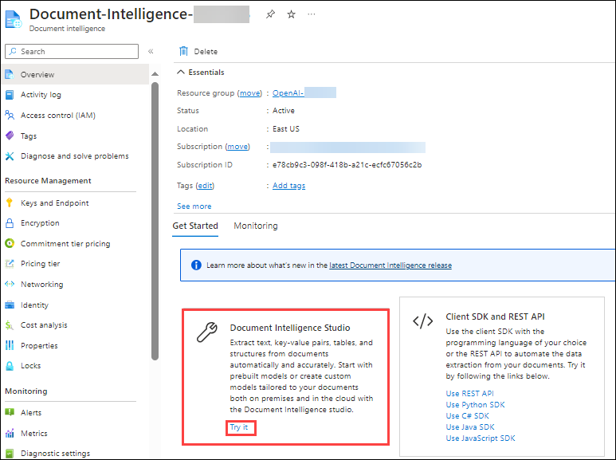
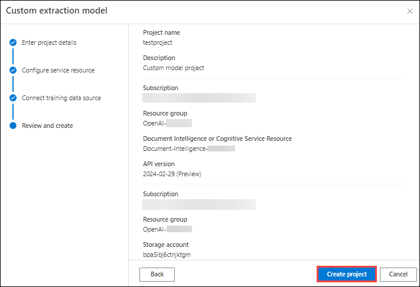

# Automate document processing using AzureOpenAI

### Lab Overview

Processing of forms and documents is part of several scenarios both in business and in everyday life. Manual data extraction from documents, either in electronic or printed format, is time-consuming, costly, and error-prone.

Azure Form Recognizer is an Applied AI Service that enables you to extract text, table data, key-value pairs, and layout information from forms and documents. In this lab, you will learn how to use train documents via Document Intelligence resource. We will be processing the documents to Cosmos DB via Azure functions and further analysing the document in Power BI. 

### Lab Objectives

In this lab, you will perform:

- Provision a Form Recognizer resource.
- Train a custom model in Form Recognizer Studio.
- Create an Azure Functions project.
- Store the extracted information from the Form Recognizer’s model in Azure Cosmos DB.
- Use Power BI to visualize the insights from the analysis of the forms.

### Instructions

### Task 1: Creating a Document Intelligence Resource

1. Search for **Document Intelligence** and select it.

   

1. Navigate to **Document-Intelligence-<inject key="Deployment ID" enableCopy="false"/>**
     

1. In the **Overview** pane, under **Document Intelligence studio** ,click on **Try it**.

   

1. In **Document Intelligence studio**, scroll down to **Custom Models** and click on **Get Started**.

   

1. Enter the following details and click on **Continue**  **(3)**.
    
   - Project name: **testproject** **(1)**.
   - Description: **Custom model project** **(2)**.

     

1. Enter the following details **Configure service resource** and click on **Continue** **(5)**.

   - Subscription: Select your **Default Subscription** **(1)**.
   - Resource group: **OpenAI-<inject key="Deployment ID" enableCopy="false"/>** **(2)**.
   - Document Intelligence or Cognitive Service Resource: Select **Document-Intelligence-<inject key="Deployment ID" enableCopy="false"/>** **(3)**.
   - API version: **Select the default version** **(4)**.

     

1. Enter the following details **Connect training data source** and click on **Continue** **(5)**.

   - Subscription: Select your **Default Subscription** **(1)**.
   - Resource group: **Document-intelligence-<inject key="Deployment ID" enableCopy="false"/>** **(2)**.
   - Storage account name: Select **storage<inject key="Deployment ID" enableCopy="false"/>** **(3)**.
   - Blob container name: **documents** **(4)**.
   
        

1. Validate the information and choose **Create project**.

     

### Task 2: Train and Label data

In this step, you will upload 6 training documents to train the model.

1. Click on **Browse for files**.

     

2.  On the file explorer, enter the following `C:\LabFiles` **(1)** path hit **enter**, select all train JPEG files **invoice_1 to **invoice_5** **(2)**, and hit **Open** **(3)**.


3. Once uploaded, choose **Run now** in the pop-up window under Run Layout.

     

4. Click on **+ Add a field** **(1)**, select **Field** **(2)**, enter the field name as **Organization_sample** **(3)** and hit **enter**.

     

     

5. Label the new field added by selecting **CONTOSO LTD** in the top left of each document uploaded. Do this for all six documents.

     

6. Once all the documents are labeled, click on **Train** in the top right corner.

     

7. Specify the model ID as **customfrs** **(1)**, Model Description as **custom model** **(2)**, from the drop-down select **Template** **(3)** as Build Mode and click on **Train** **(4)**.

     

8. Click on **Go to Models**. 

   

9. Wait till the model status shows **succeeded** **(1)**. Once the status Select the model **customfrs** **(2)** you created and choose **Test** **(3)**.

     

10. On the Test model window, click on **Browse for files**. 

     

11. On the file explorer, enter the following `C:\LabFiles` **(1)** path hit **enter**, select all test JPEG files **test1 and test2** **(2)**, and hit **Open** **(3)**.

12. Once uploaded, select one test model, and click on **Run analysis** **(1)**, Now you can see on the right-hand side that the model was able to detect the field **Organization_sample** **(2)** we created in the last step along with its confidence score.

### Task 3: Deploy Function App

1. Navigate to the document intelligence resource you created earlier.

1. Navigate to **Keys and Endpoint (1)** under Resource Management pane, copy the **key (2)** and **endpoint (3)** in a notepad.
   
1. Navigate to **storage<inject key="Deployment ID" enableCopy="false"/>**

1. Navigate to **Access Keys** under Security + Networking pane and copy the **Connection String** in a notepad.

1. Click on **Containers** under the **Data Storage tab** in the left pane and select the **input** container.

1. Click on **Shared Access Tokens (1)** under the **Settings** tab from the left pane, provide **Read, Add, Create and Write (2)** permissions and click on **Generate SAS Token and URL (3)**.
   
1. Navigate to **Visual Studio Code**, click on **Open Folder (1)** , navigate to **C:/Labfiles (2)** and select **funtion-app (3)**.

1. Click on the **Azure symbol (1)** , select **Create Function (2)** by clicking on the **funtion-app icon (3)**

1. You'll be prompted to configure several settings:

   - Select the folder → choose **function-app**.
     
   - Select a language → choose **Python**.

   - Select a Python Programming Model → choose **Model V2**.

   - Select a Python interpreter to create a virtual environment → select **Python 3.11**.

   - Select a template → choose **Blob trigger** and give the trigger a name or accept the default name. Press **Enter** to confirm.

   - The path within your storage container that the trigger will monitor → **input**.

   - Select setting → choose ➕**Create new local app setting** from the dropdown menu.

   - Select subscription → choose your **Azure subscription** with the storage account you created → select your **storage account** → then select the name of the storage input container. Press **Enter** to confirm.

   - Select how your would like to open your project → choose **Open the project in the current window** from the dropdown menu.

1. In VS Code, navigate to the function's **requirements.txt** file. This file defines the dependencies for your script. Add the following Python packages to the file:
   
      ```
      cryptography
      azure-functions
      azure-storage-blob
      azure-identity
      requests
      pandas
      numpy
   
      ```

1. Open the **function-app.py** file and add the following import statements:

      ```
   
      import logging
      from azure.storage.blob import BlobServiceClient
      import azure.functions as func
      import json
      import time
      from requests import get, post
      import os
      import requests
      from collections import OrderedDict
      import numpy as np
      import pandas as pd
   
      ```

1. Add the following code block that calls the **Document Intelligence Analyze Layout API** on the uploaded document. Fill in your **endpoint and key values (1)**.

   ```
   
   # This is the call to the Document Intelligence endpoint
       endpoint = r"Your Document Intelligence Endpoint"
       apim_key = "Your Document Intelligence Key"
       post_url = endpoint + "/formrecognizer/v2.1/layout/analyze"
       source = myblob.read()
   
       headers = {
       # Request headers
       'Content-Type': 'application/pdf',
       'Ocp-Apim-Subscription-Key': apim_key,
           }
   
   ```

1. Next, add code to query the service and get the returned data.

   ```
   
      resp = requests.post(url=post_url, data=source, headers=headers)
   
   if resp.status_code != 202:
       print("POST analyze failed:\n%s" % resp.text)
       quit()
   print("POST analyze succeeded:\n%s" % resp.headers)
   get_url = resp.headers["operation-location"]
   
   wait_sec = 25
   
   time.sleep(wait_sec)
   # The layout API is async therefore the wait statement
   
   resp = requests.get(url=get_url, headers={"Ocp-Apim-Subscription-Key": apim_key})
   
   resp_json = json.loads(resp.text)
   
   status = resp_json["status"]
   
   if status == "succeeded":
       print("POST Layout Analysis succeeded:\n%s")
       results = resp_json
   else:
       print("GET Layout results failed:\n%s")
       quit()
   
   results = resp_json
   
   ```

1. Add the following code to connect to the Azure Storage output container. Fill in the values for the storage account name and key.

   ```
   
   # This is the connection to the blob storage, with the Azure Python SDK
       blob_service_client = BlobServiceClient.from_connection_string("DefaultEndpointsProtocol=https;AccountName="Storage Account Name";AccountKey="storage account key";EndpointSuffix=core.windows.net")
       container_client=blob_service_client.get_container_client("output")
   
   ```

1. Next, add the following code that parses the returned Document Intelligence response, constructs a .csv file, and uploads it to the output container

   ```
   
   # The code below extracts the json format into tabular data.
       # Please note that you need to adjust the code below to your form structure.
       # It probably won't work out-of-the-box for your specific form.
       pages = results["analyzeResult"]["pageResults"]
   
       def make_page(p):
           res=[]
           res_table=[]
           y=0
           page = pages[p]
           for tab in page["tables"]:
               for cell in tab["cells"]:
                   res.append(cell)
                   res_table.append(y)
               y=y+1
   
           res_table=pd.DataFrame(res_table)
           res=pd.DataFrame(res)
           res["table_num"]=res_table[0]
           h=res.drop(columns=["boundingBox","elements"])
           h.loc[:,"rownum"]=range(0,len(h))
           num_table=max(h["table_num"])
           return h, num_table, p
   
       h, num_table, p= make_page(0)
   
       for k in range(num_table+1):
           new_table=h[h.table_num==k]
           new_table.loc[:,"rownum"]=range(0,len(new_table))
           row_table=pages[p]["tables"][k]["rows"]
           col_table=pages[p]["tables"][k]["columns"]
           b=np.zeros((row_table,col_table))
           b=pd.DataFrame(b)
           s=0
           for i,j in zip(new_table["rowIndex"],new_table["columnIndex"]):
               b.loc[i,j]=new_table.loc[new_table.loc[s,"rownum"],"text"]
               s=s+1
   
   ```

1. Finally, the last block of code uploads the extracted table and text data to your blob storage element.

   ```
   # Here is the upload to the blob storage
       tab1_csv=b.to_csv(header=False,index=False,mode='w')
       name1=(os.path.splitext(text1)[0]) +'.csv'
       container_client.upload_blob(name=name1,data=tab1_csv)
   ```

### Task 4: Run the Function App

1. Press F5 to run the function

1. Once the funtion has been run successfully, navigate to `portal.azure.com`.

1. Navigate to storage account and click on the output container.

1. Click on the folder created as a result of the trigger and verify the json analysing the document has been generated.

### Task 5: Utilize Cosmos DB to process the documents


### Task 6: Visulalize with PowerBI

## Review

In this lab, you have accomplished the following:
