# Automate document processing using AzureOpenAI

### Lab Overview

Processing of forms and documents is part of several scenarios both in business and in everyday life. Manual data extraction from documents, either in electronic or printed format, is time-consuming, costly, and error-prone.

Document processing using Azure involves leveraging Azure services and tools to analyze, extract information from, and manage various types of documents, such as text files, images, PDFs, and more. This process typically includes tasks like text extraction, data extraction, sentiment analysis, language detection, optical character recognition (OCR), and document classification. 

In this lab, you will learn how to use train documents via Document Intelligence resource. We will be processing the documents via Azure functions and Azure OpenAI. 

### Architecture Diagram

   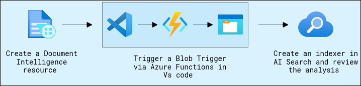

### Lab Objectives

In this lab, you will perform:

- Train a custom model in Document Intelligence Studio.
- Create Function App trigger to process documents.
- Analyze using AI Search Indexer.

### Instructions

### Task 1: Creating a Document Intelligence Resource

1. Search for **Document Intelligence** and select it.

   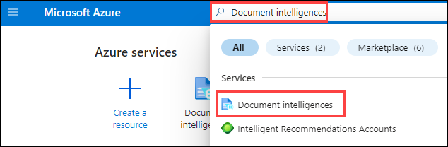

1. Navigate to **Document-Intelligence-<inject key="Deployment ID" enableCopy="false"/>**

   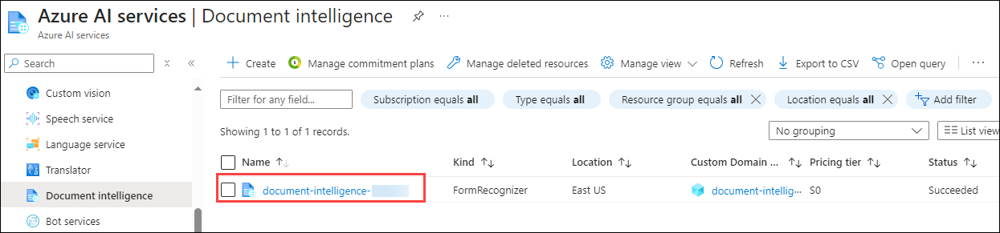

1. In the **Overview** pane, scroll down to **Get Started** tab and click on **Go to Document Intelligence studio**.

   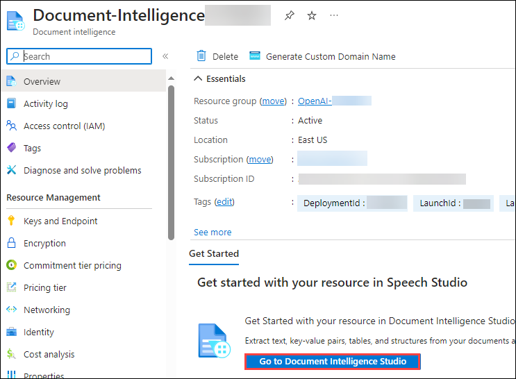

1. In **Document Intelligence studio**, scroll down to **Custom Models** and click on **Get Started** for Custom extraction model.

   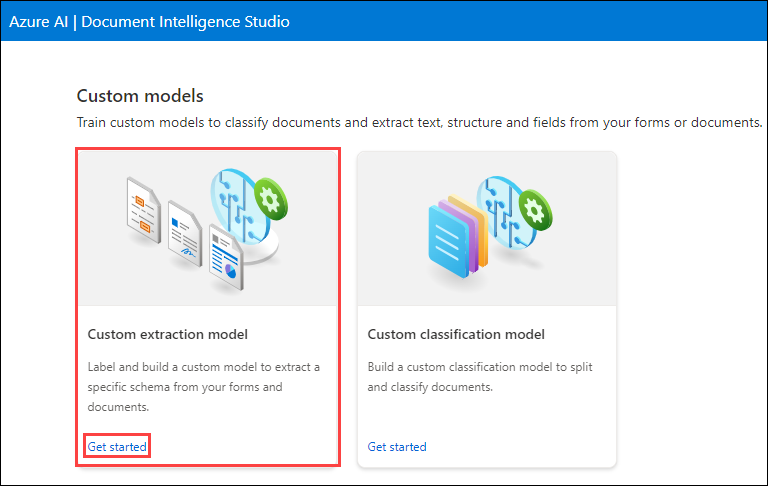

1. Click on **Create a project** ,Enter the following details and click on **Continue**  **(3)**.
    
   - Project name: **testproject** **(1)**.
   - Description: **Custom model project** **(2)**.

     

1. Enter the following details **Configure service resource** and click on **Continue** **(5)**.

   - Subscription: Select your **Default Subscription** **(1)**.
   - Resource group: **OpenAI-<inject key="Deployment ID" enableCopy="false"/>** **(2)**.
   - Document Intelligence or Cognitive Service Resource: Select **Document-Intelligence-<inject key="Deployment ID" enableCopy="false"/>** **(3)**.
   - API version: **Select the default version** **(4)**.

     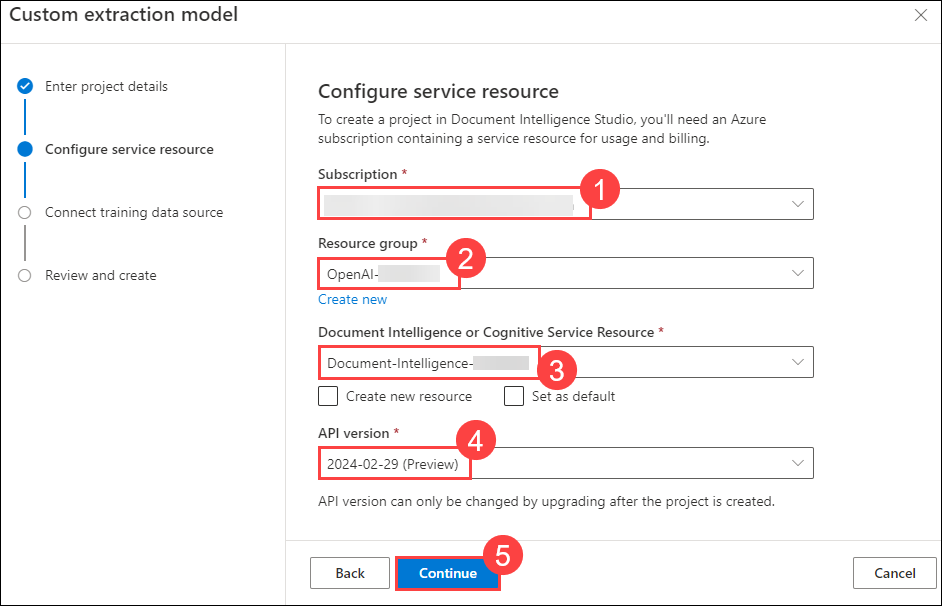

1. Enter the following details **Connect training data source** and click on **Continue** **(5)**.

   - Subscription: Select your **Default Subscription** **(1)**.
   - Resource group: **OpenAI-<inject key="Deployment ID" enableCopy="false"/>** **(2)**.
   - Storage account name: Select **storage<inject key="Deployment ID" enableCopy="false"/>** **(3)**.
   - Blob container name: **analysis** **(4)**.
   
        

1. Validate the information and choose **Create project**.

     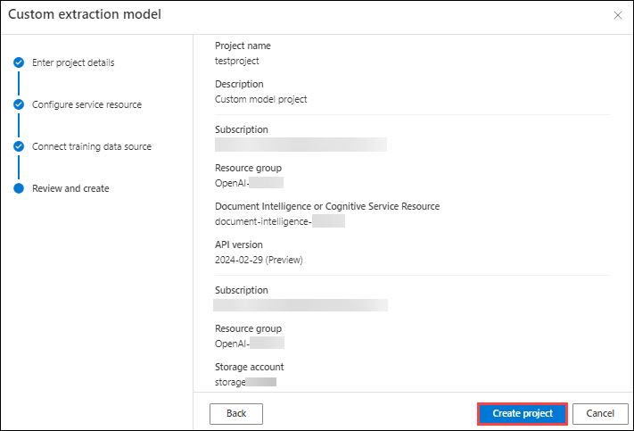

### Task 2: Train and Label data

In this step, you will upload 6 training documents to train the model.

1. Click on **Browse for files**.

     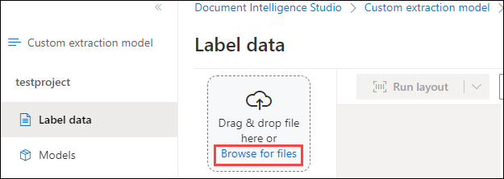

1. On the file explorer, enter the following path `C:\LabFiles\Train`, hit **enter**, select all train PDF files present inside **Train** folder i.e **invoice_1 to invoice_5** **(2)**, and hit **Open** **(3)**.

   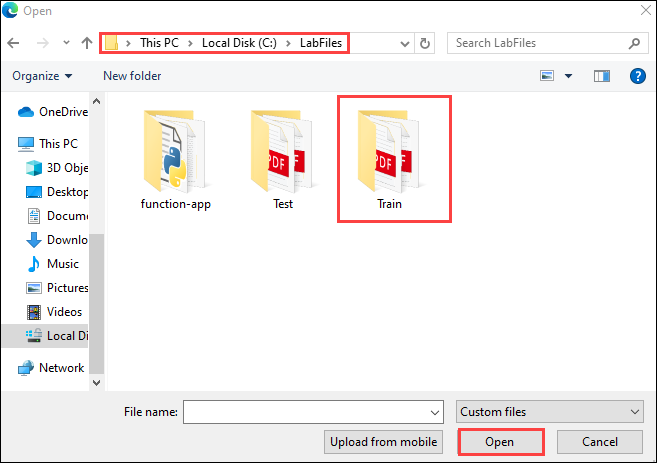

   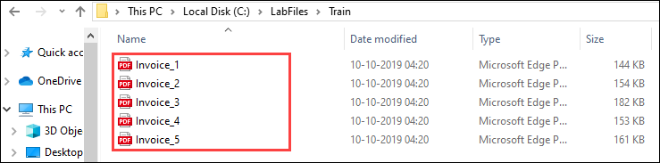

1. Once uploaded, choose **Run now** in the pop-up window under Run Layout.

     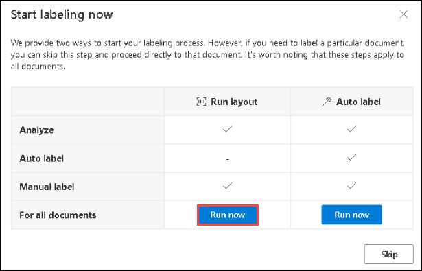

1. Click on **+ Add a field** **(1)**, select **Field** **(2)**, enter the field name as **Organization** **(3)** and hit **enter**.

     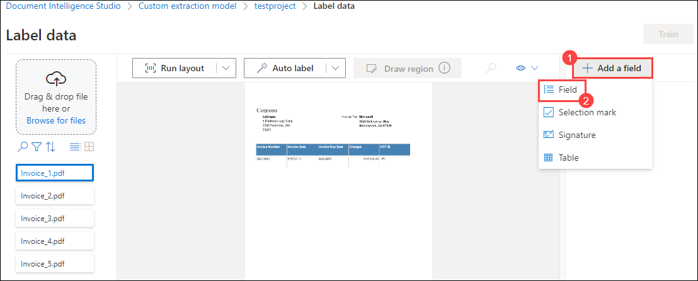

     

1. Ensure you have selected **invoice_1** and Label the new field added by selecting **Contoso (1)** in the top left of each document uploaded. Do this for all five documents wherever there is an organization mentioned.

     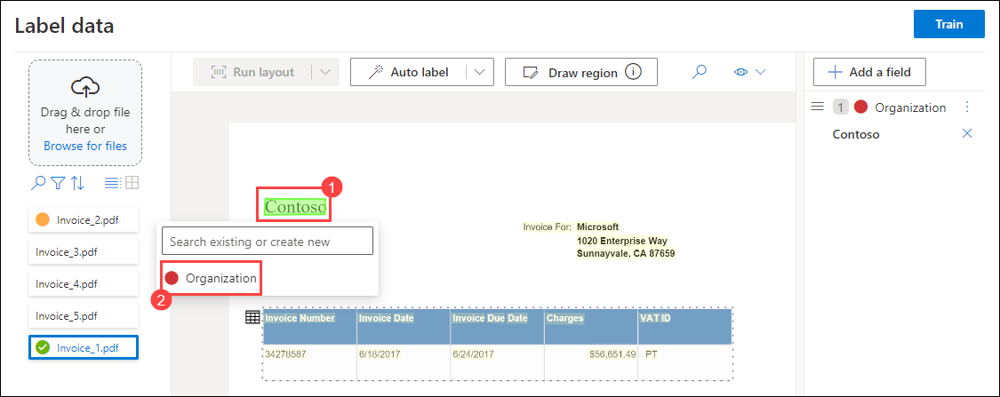

1. Click on **+ Add a field** **(1)**, enter the field name as **Address** **(2)** and hit **enter**.

   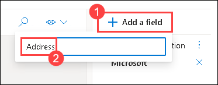
   
1. Label the new field added by **selecting the address (2)** as shown in the below image and do this for all the five documents.

   
   
1. Once all the documents are labeled, click on **Train** in the top right corner.

     

1. Specify the model ID as **model (1)**, Model Description as **custom model (2)** , from the drop-down select **Template (3)** as Build Mode and click on **Train (4)**.

     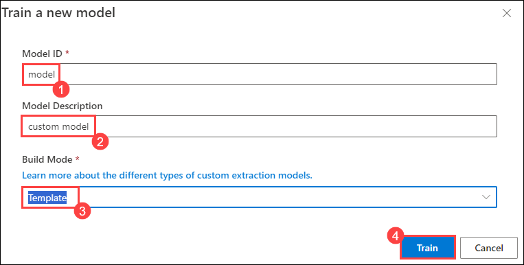

1. Click on **Go to Models**. 

   
   
1. Wait till the model status shows **succeeded**. Once the status Select the model **model**  **(1)** you created and choose **Test** **(2)**.

     

1. On the Test model window, click on **Browse for files**. 

     

1. On the file explorer, enter the following `C:\LabFiles\Test` **(1)** path hit **enter**, select all test PDF files **invoice6 and invoice7** **(2)**, and hit **Open** **(3)**.

      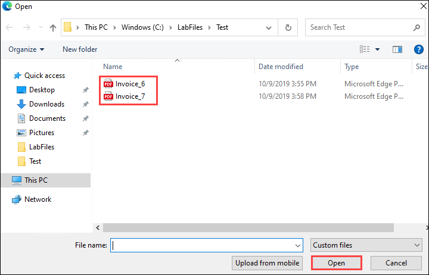

1. Once uploaded, select one test model, and click on **Run analysis**, Now you can see on the right-hand side that the model was able to detect the field **Organization** and **Address** we created in the last step along with its confidence score.

   
   
### Task 3: Creation of Function App

You will be using Azure Functions to process documents that are uploaded to an Azure blob storage container. This workflow extracts table data from stored documents using the Document Intelligence layout model and saves the data in a JSON file in Azure.
   
1. Open **Visual Studio Code** from the Lab VM desktop by double-clicking on it. click on **Open Folder (1)** , navigate to **C:/Labfiles (2)** and select **funtion-app (3)**.

   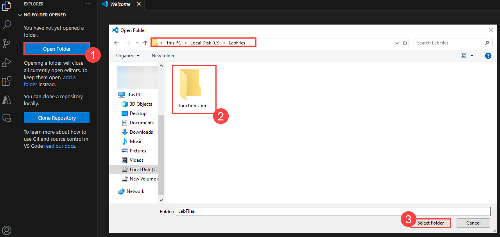

1. Click on the **Azure symbol (1)** , select **Create Function (2)** by clicking on the **funtion-app icon (3)**

   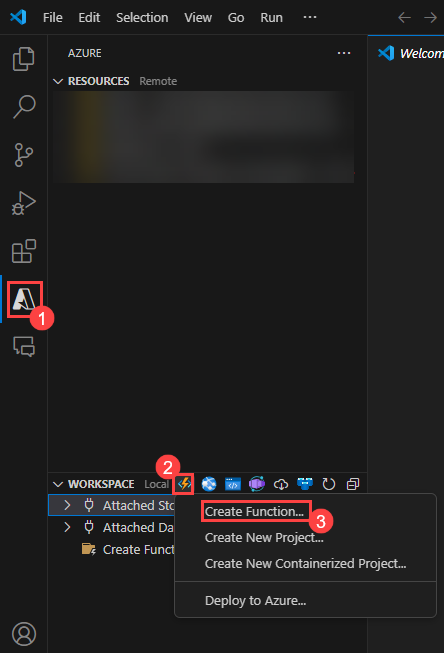

1. You'll be prompted to configure several settings:

   - Select the folder → choose **function-app**.
     
   - Select a language → choose **Python**.

   - Select a Python Programming Model → choose **Model V2**.

   - Select a Python interpreter to create a virtual environment → select **Python 3.11**.

   - Select a template → choose **Blob trigger** and give the trigger a name or accept the default name. Press **Enter** to confirm.

   - The path within your storage container that the trigger will monitor → **input**.

   - Select setting → choose ➕**Create new local app setting** from the dropdown menu.

   - Click on **Sign in to Azure** and click on **Allow** if prompted. This will navigate to Azure Portal and select your Azure Account.

        - Email: <inject key="AzureAdUserEmail"></inject>
        - Password: <inject key="AzureAdUserPassword"></inject>

   - Select subscription → choose the **Default Subscription**,

   - Select a storage account type for development → choose **Use Azure Storage for remote storage** and select **storage<inject key="Deployment ID" enableCopy="false"/>** → then select the name of the storage **input** container. Press **Enter** to confirm.

   - Select how your would like to open your project → choose **Open the project in the current window** from the dropdown menu.

1. In VS Code, navigate to the function's **requirements.txt** file. This file defines the dependencies for your script. Add the following Python packages to the file and click on ` Ctrl + S ` :
   
      ```
      cryptography
      azure-functions
      azure-storage-blob
      azure-identity
      requests
      pandas
      numpy
   
      ```

      >**Note:** In cases of an error, please run `pip install -r requirements.txt`

      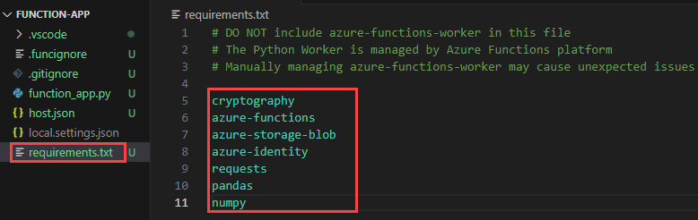

1. Click on the **local.settings.json** file and replace **AzureWebJobsStorage** with the storage account connection string **<inject key="connectionString"></inject>**. You can also update the configuration by adding `"AzureWebJobsSecretStorageType": "Files"` if it isn’t already included. Ensure to keep the rest as default.

   ```
      {
     "IsEncrypted": false,
     "Values": {
       "AzureWebJobsStorage": "<Connection-string>",
       "FUNCTIONS_WORKER_RUNTIME": "python",
       "AzureWebJobsFeatureFlags": "EnableWorkerIndexing",
       "storageaccount-name_STORAGE": "<Connection-string-DEFAULT>",
       "AzureWebJobsSecretStorageType": "Files"
     }
   }
   ```

1. Right click on function-app folder and click on **New File**.

   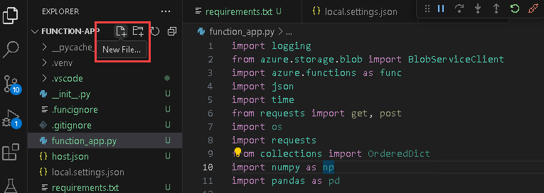
   
1. Provide the name as `__init__.py` and add the following statements:

   ```
   import logging
   from azure.storage.blob import BlobServiceClient
   import azure.functions as func
   import json
   import time
   from requests import get, post
   import os
   import requests
   from collections import OrderedDict
   import numpy as np
   import pandas as pd
   app = func.FunctionApp()
    
   def blob_trigger(myblob: func.InputStream):
     logging.info(f"Python blob trigger function processed blob"
                  f"Name: {myblob.name}" 
                  f"Blob Size: {myblob.length} bytes")

   ```
   
1. Open the **function-app.py** file and add the following import statements by replacing the existing ones:

      ```
      import logging
      from azure.storage.blob import BlobServiceClient
      import azure.functions as func
      import json
      import time
      from requests import get, post
      import os
      import requests
      from collections import OrderedDict
      import numpy as np
      import pandas as pd
      ```

      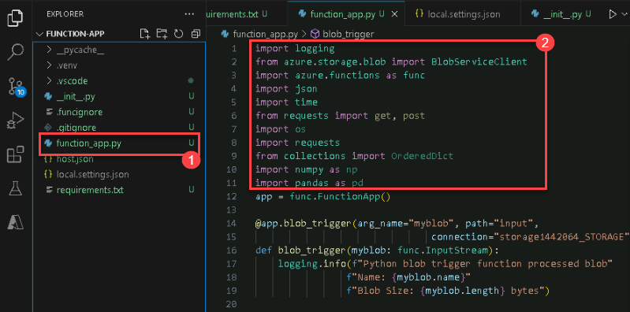
   
1.  Modify the main function, where replace:

    - path = **input**
    
    - connection = **storage<inject key="Deployment ID" enableCopy="false"/>_STORAGE**
      ```
      app = func.FunctionApp()
   
      @app.blob_trigger(arg_name="myblob", path="<container-name>", connection="<storage-account-name>_STORAGE")
   
      def blob_trigger(myblob: func.InputStream):
          logging.info(f"Python blob trigger function processed blob"
                      f"Name: {myblob.name}" 
                      f"Blob Size: {myblob.length} bytes")
      ```

1. Add the following code block that calls the **Document Intelligence Analyze Layout API** on the uploaded document.
   - Replace **Your Document Intelligence Endpoint** : **<inject key="documentIntelligenceEndpoint"></inject>**.
   - Replace **Your Document Intelligence Key** : **<inject key="documentIntelligenceKey"></inject>**.
   - Replace `<MODEL-NAME>` with **model**.

   ```
       # This is the call to the Document Intelligence endpoint
       endpoint = r"Your Document Intelligence Endpoint"
       apim_key = "Your Document Intelligence Key"
       post_url = endpoint + "/formrecognizer/documentModels/<MODEL-NAME>:analyze?api-version=2023-02-28-preview"
       source = myblob.read()
   
       headers = {
       # Request headers
       'Content-Type': 'application/pdf',
       'Ocp-Apim-Subscription-Key': apim_key,
           }
   ```

   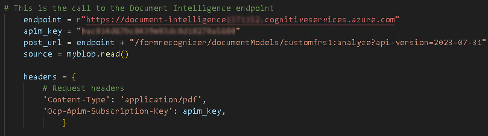
   
1. Next, add code to query the service and get the returned data.

   ```
      resp = requests.post(url=post_url, data=source, headers=headers)
   
      if resp.status_code != 202:
          print("POST analyze failed:\n%s" % resp.text)
          quit()
      print("POST analyze succeeded:\n%s" % resp.headers)
      get_url = resp.headers["operation-location"]
      
      wait_sec = 25
      time.sleep(wait_sec)
      # The layout API is async therefore the wait statement
      resp = requests.get(url=get_url, headers={"Ocp-Apim-Subscription-Key": apim_key})
      resp_json = json.loads(resp.text)
      status = resp_json["status"]
      
      if status == "succeeded":
          print("POST Layout Analysis succeeded:\n%s")
          results = resp_json
      else:
          print("GET Layout results failed:\n%s")
          quit()
      
      results = resp_json
   ```

1. Add the following code to connect to the Azure Storage output container.
   
   - Replace {storage-connection-string} : **<inject key="connectionString"></inject>**.

   ```
       # This is the connection to the blob storage, with the Azure Python SDK
       blob_service_client = BlobServiceClient.from_connection_string("{storage-connection-string}")
       container_client=blob_service_client.get_container_client("output")
   
       # Assuming `results` is your JSON data
       data = json.dumps(results)

       # Create a new blob and upload the data
       blob_name = myblob.name + ".json"
       blob_client = container_client.get_blob_client(blob_name)
       blob_client.upload_blob(data, overwrite=True)
   ```

1. Please verify to ensure that the final code matches as below.

   ```
   import logging
   from azure.storage.blob import BlobServiceClient
   import azure.functions as func
   import json
   import time
   from requests import get, post
   import os
   import requests
   from collections import OrderedDict
   import numpy as np
   import pandas as pd
   
   app = func.FunctionApp()
   
   @app.blob_trigger(arg_name="myblob", path="<input container", connection="storage<DID>_STORAGE") 
   
   def blob_trigger(myblob: func.InputStream):
       logging.info(f"Python blob trigger function processed blob"
                   f"Name: {myblob.name}"
                   f"Blob Size: {myblob.length} bytes")
   
       # This is the call to the Document Intelligence endpoint
       endpoint = r"<document-intelligence-endpoint>"
       apim_key = "<document-intelligence-key>"
       post_url = endpoint + "/formrecognizer/documentModels/<model-name>:analyze?api-version=2023-07-31"
       source = myblob.read()
       
       headers = {
           # Request headers
           'Content-Type': 'application/pdf',
           'Ocp-Apim-Subscription-Key': apim_key,
               }
       
       resp = requests.post(url=post_url, data=source, headers=headers)
   
       if resp.status_code != 202:
           print("POST analyze failed:\n%s" % resp.text)
           quit()
       print("POST analyze succeeded:\n%s" % resp.headers)
       get_url = resp.headers["operation-location"]
       
       wait_sec = 25
       time.sleep(wait_sec)
       # The layout API is async therefore the wait statement
       resp = requests.get(url=get_url, headers={"Ocp-Apim-Subscription-Key": apim_key})
       resp_json = json.loads(resp.text)
       status = resp_json["status"]
       
       if status == "succeeded":
           print("POST Layout Analysis succeeded:\n%s")
           results = resp_json
       else:
           print("GET Layout results failed:\n%s")
           quit()
       
       results = resp_json
   
       # This is the connection to the blob storage, with the Azure Python SDK
       blob_service_client = BlobServiceClient.from_connection_string("<storage account connection string")
       container_client=blob_service_client.get_container_client("output")
   
       # Assuming `results` is your JSON data
       data = json.dumps(results)
   
       # Create a new blob and upload the data
       blob_name = myblob.name + ".json"
       blob_client = container_client.get_blob_client(blob_name)
       blob_client.upload_blob(data, overwrite=True)
   ```

> **Note**: Please make sure the indentation of the code remains unchanges and proper to run the code successfully

### Task 4: Run the Function App

1. In VS Code, click on the ellipsis above, expand **Terminal (1)** and select **New Terminal (2)**.

   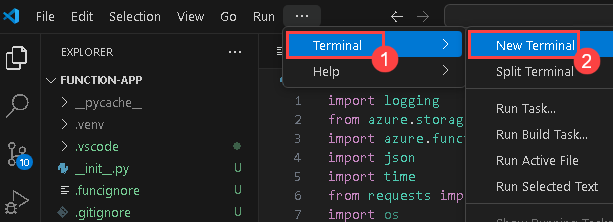

1. Press **F5** to run the function.

1. Once the funtion has been run successfully, navigate to `portal.azure.com` when it triggers to add an input file as shown below.

   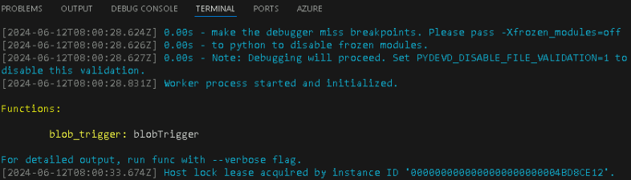

1. In the search bar, search and select **Storage Account**.

1. Select storage account **storage<inject key="Deployment ID" enableCopy="false"/>**.

1. In the storage account **storage<inject key="Deployment ID" enableCopy="false"/>**, navigate to **Containers** under the **Data Storage** tab and select **input** container.

   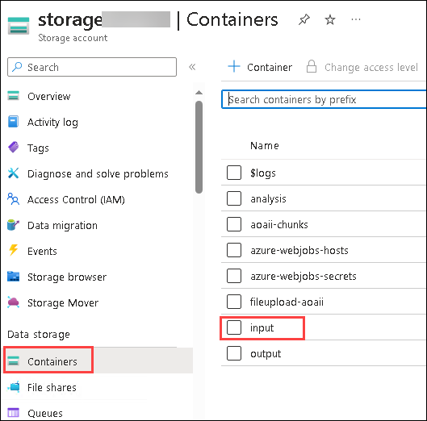
   
1. In the input container, click on **Upload (1)** button, in the **Upload blob** pop-up window click on **Browse for files (2)**.

   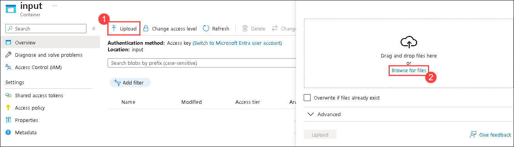

1. Navigate to `C:\LabFiles\test`, select **Invoice_6 and Invoice_7**, and click on **Open**.

   .png)

1. In the **Upload blob** pop-up window, click on **Upload** button.

1. Navigate back to the **VS code** and verify the **logs**.

1. Once the function app triggered successfully, navigate back to the **storage account**.

1. In the storage account, click on **Containers** under Data Storage tab and select **Output** container.

1. In the **Output** container, click on the **input** folder and verify the **json** analysing the document has been generated successfully.

   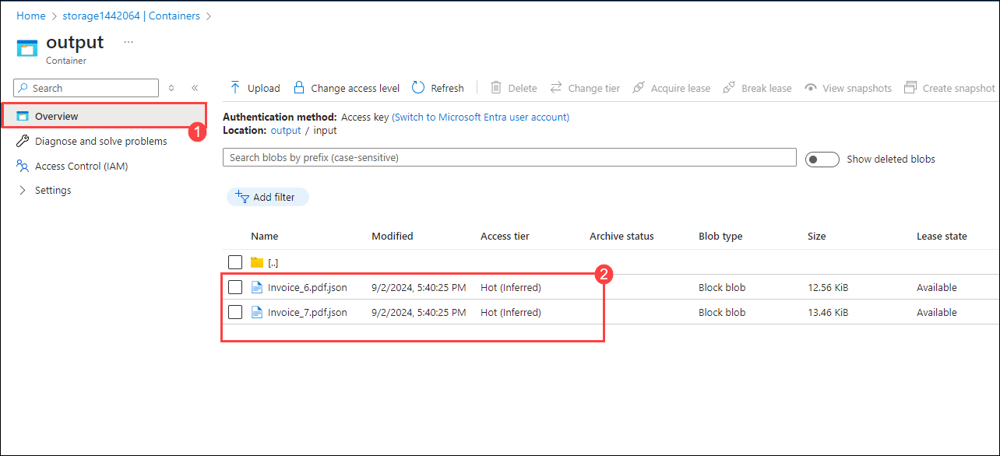

### Task 5: Working with AI Search

1. In the search bar, search for **AI Search** and select it.

   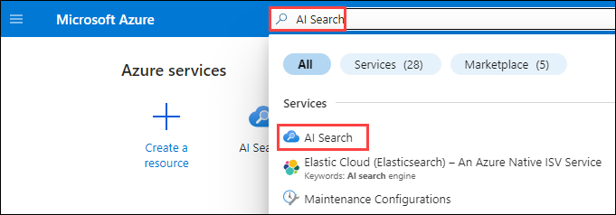
   
1. In **Azure AI services | AI Search** tab, select **search-<inject key="Deployment ID" enableCopy="false"/>**.

   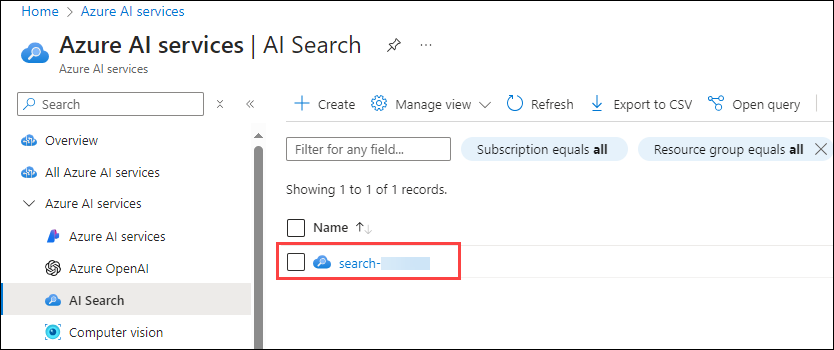
   
1. In the Overview page of **search-<inject key="Deployment ID" enableCopy="false"/>**, click on **Import data**.

   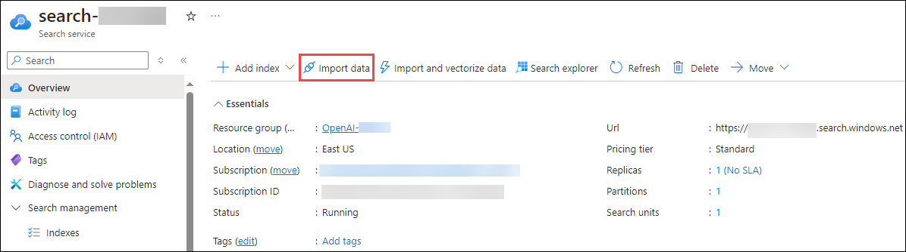

1. Provide the following values:

   - Data Source: **Azure Blob Storage (1)**
   - Data Source Name: **data-source-<inject key="Deployment ID" enableCopy="false"/> (2)**
   - Parsing Mode: **JSON (3)**
   - Subscription: **Select the default subscription (4)**
   - Connection string: Click on **Choose an existing Connection** then Select **storage<inject key="Deployment ID" enableCopy="false"/>** and then select **output** container **(5)**.

        .png)
     
   - Container Name: **Output (6)**
   - Blob Folder: **input (7)**
   - Click on **Next: Add cognitive skills (Optional) (8)**

   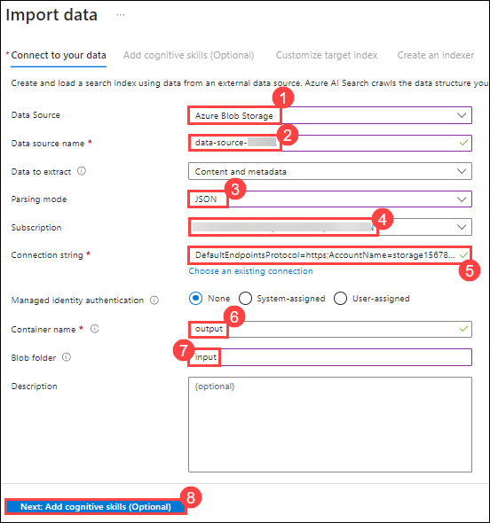

1. On the Add **cognitive skills (Optional)**, click on **Skip to : Customize target index**.

1. On the **Customize target index**, enter Index name as **azureblob-index** **(1)**, make all fields **Retrievable** **(2)**, and **Searchable** **(3)**.

   

1. Expand the **AnalyzeResult** **(1)** > **documents** **(2)** > **fields** **(3)** , expand **Organization** and **Address** and make the two fields Facetable **(type, valueString & content)** **(6)** and click on **Next: Create an indexer** **(7)**.

   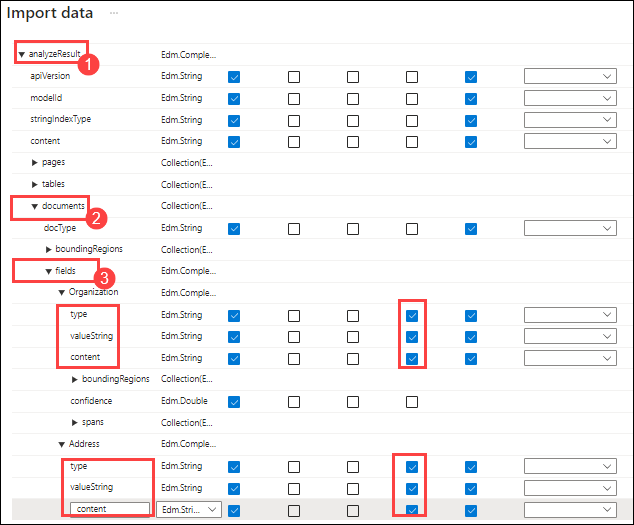
      
1. On the **Create an indexer** page, enter the name as **azureblob-indexer** **(1)** and click on **Submit** **(2)**.
   
   

1. Select **indexes** under the **search management** tab and click on **azureblob-index**.

   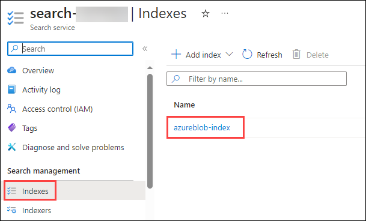

1. In the **azureblob-index**, click on **Search** button.

   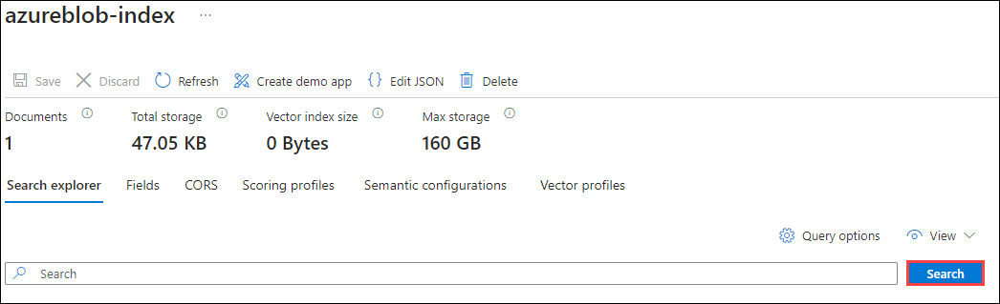

1. Verify the document that has been analysed

   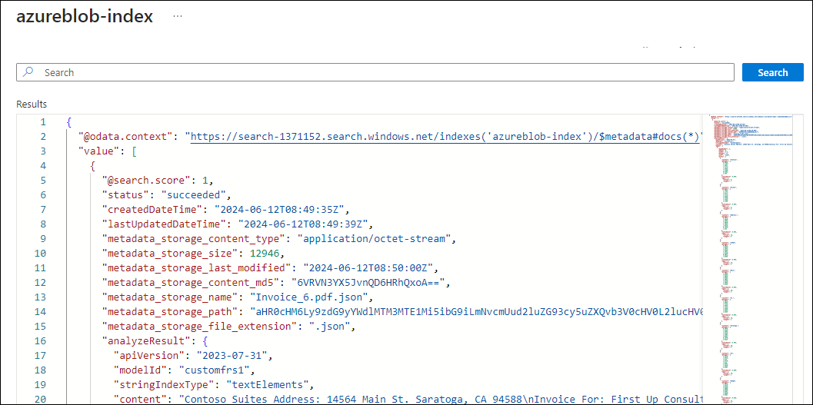

1. Search for `fields` and verify the fields given while training the document has been analysed.
   
   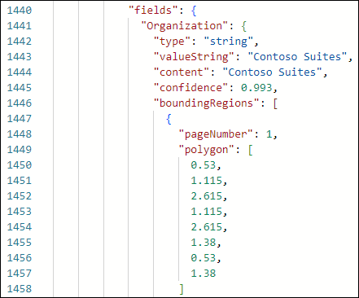

   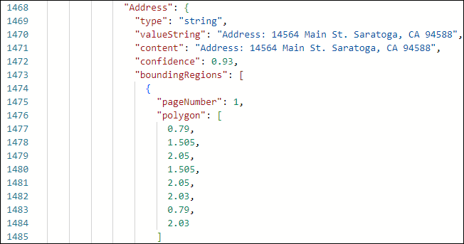
   
## Review

In this lab, you have trained datasets using document intelligence resource, triggered the documents using function app blob trigger, analysed the documents produced by storage account in AI Search.

### You have successfully completed the lab
