# Lab 01: Automate Document Processing using Azure AI Document Intelligence

### Estimated Duration: 120 Minutes

## Overview
Processing of forms and documents is part of several scenarios, both in business and in everyday life. Manual data extraction from documents, either in electronic or printed format, is time-consuming, costly, and error-prone. Document processing using Azure involves leveraging Azure services and tools to analyze, extract information from, and manage various types of documents, such as text files, images, PDFs, and more. This process typically includes tasks like text extraction, data extraction, sentiment analysis, language detection, optical character recognition (OCR), and document classification. In this lab, you will learn how to train documents via the Document Intelligence resource. We will be processing the documents via **Azure Function Apps** and <code style="color : red">**Azure AI Document Intelligence**</code>.

## Architecture Diagram

   

## Lab Objectives

In this lab, you will perform:

- Task 1: Creating a Document Intelligence Resource
- Task 2: Train and Label data
- Task 3: Creation of Function App
- Task 4: Run the Function App
- Task 5: Working with AI Search

## Task 1: Creating a Document Intelligence Resource

In this task, you will set up the Document Intelligence environment in Azure so you can build and train a custom document extraction model. It creates a project in Document Intelligence Studio, connects it to the correct Azure resource, and links a storage location for training data. By the end, you have a fully configured project ready for model training.

1. In the search bar, enter **Document Intelligence (1)** and select **Document Intelligence (2)** from the **Services** list.

   

1. Navigate to **document-intelligence-<inject key="Deployment ID" enableCopy="false"/>**.

   

1. In the **Overview (1)** pane, scroll down to the **Get Started** tab and click on **Go to Document Intelligence Studio (2)**.

   .png)

   >**Note:** If prompted, sign in using the same credentials you used to log in to Azure.

1. In **Document Intelligence Studio** page, scroll down to **Custom models** and click on **Get started** for **Custom extraction model**. 

   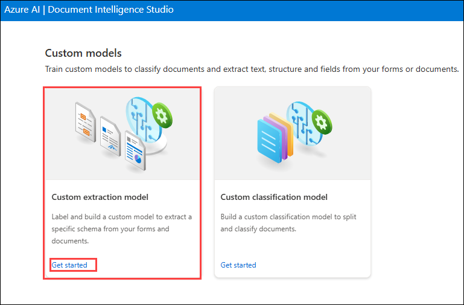

   >**Note:** If prompted, login using the below Azure credentials.

   **Email/Username:** <inject key="AzureAdUserEmail"></inject>

   **Password:** <inject key="AzureAdUserPassword"></inject>

   .png)

   .png)

1. Under **My Projects** blade, click on **+ Create a project**. Enter the following details and click on **Continue**  **(3)**.

   .png)
    
   - Project name: **testproject** **(1)**.
   - Description: **Custom model project** **(2)**.

     

1. Enter the following details for **Configure service resource** and click on **Continue** **(5)**.

   - Subscription: Select your **Default Subscription** **(1)**.
   - Resource group: **OpenAI-<inject key="Deployment ID" enableCopy="false"/>** **(2)**.
   - Document Intelligence or Cognitive Service Resource: Select **document-intelligence-<inject key="Deployment ID" enableCopy="false"/>** **(3)**.
   - API version: Select **2024-11-30 (4.0 General Availability)** **(4)**.

     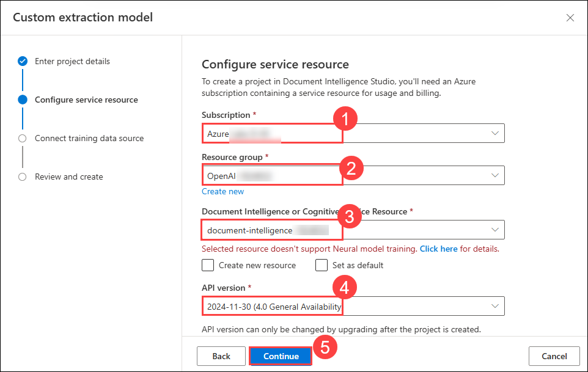

1. Enter the following details for **Connect training data source** and click on **Continue** **(5)**.

   - Subscription: Select your **Default Subscription** **(1)**.
   - Resource group: **OpenAI-<inject key="Deployment ID" enableCopy="false"/>** **(2)**.
   - Storage account: Select **storage<inject key="Deployment ID" enableCopy="false"/>** **(3)**.
   - Blob container: **analysis** **(4)**.
   
        

1. Review the configuration and select **Create project**.

     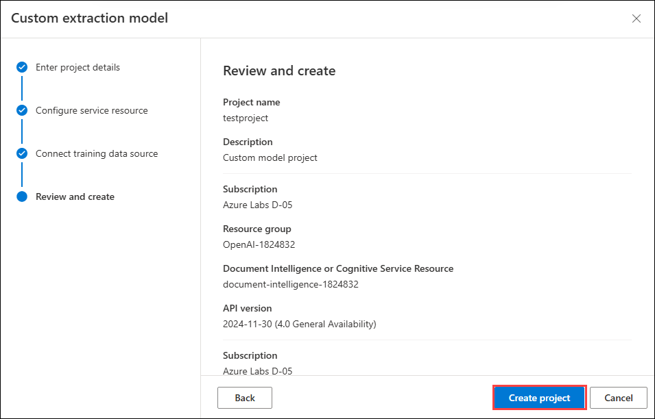

## Task 2: Train and Label data

In this task, you will upload and labels invoice documents to train a custom model in Document Intelligence Studio. It defines key fields like Organization and Address, then trains the model using the labeled data. Finally, it tests the model with new documents to verify accurate field extraction and review confidence scores. In this step, you will upload 6 training documents to train the model.

1. Click on **Browse for files**.

     

1. On the file explorer, enter the following path `C:\LabFiles\Train`**(1)**, press **Enter**, select all train PDF files present inside **Train** folder, i.e, **Invoice_1 to Invoice_5** **(2)**, and click on **Open (3)**.

   .png)

1. Once uploaded, choose **Run now** in the pop-up window under **Run layout**.

     

1. Click on **+ Add a field** **(1)**, select **Field** **(2)**, enter the field name as **Organization** **(3)** and press **Enter**.

     

     

1. Follow the steps below:

   - Ensure you have selected **Invoice_1**

   - Select **Contoso (1)** as shown in figure.

   - It will prompt you to select **Organization (2)** You will observe green tick on Invoice_1.pdf.

     

1. Click on **+ Add a field** **(1)**, select **Field** **(2)**, enter the field name as **Address** **(3)** and hit **enter**.

   

   

1. Label the new field added by **selecting the address (2)** as shown in the image below, and do this for all the **five documents**.

   
   
1. Once all the documents are labeled, click on **Train** in the top right corner.

     

1. In the **Train a new model** window, specify the Model ID as **model (1)**, Model Description as **custom model (2)** , from the drop-down select **Template (3)** as Build Mode and click on **Train (4)**.

     

1. In **Training in process** pop-up window, click on **Go to Models**. 

   
   
1. Wait till the model status shows **Succeeded**. Once the status has succeeded, Select the model **model**  **(1)** you created and choose **Test** **(2)**.

     

1. On the **Test model** window, click on **Browse for files**. 

     

1. On the file explorer, enter the following `C:\LabFiles\Test` **(1)** path, hit **Enter**, select all test PDF files **Invoice6 and Invoice7** **(2)**, and click on **Open** **(3)**.

      

1. Once uploaded, select one test model and click on **Run analysis**. Now you can see on the right-hand side that the model was able to detect the field **Organization** and **Address** we created in the last step, along with its confidence score.

   
   
## Task 3: Creation of Function App

In this task, you will be using Azure Functions to process documents that are uploaded to an Azure blob storage container. This workflow extracts table data from stored documents using the Document Intelligence layout model and saves the data in a JSON file in Azure.
   
1. Open **Visual Studio Code** from the Lab VM desktop by double-clicking on it. 

   

2. Once inside VS-Code, click on **File -> Open Folder**.

   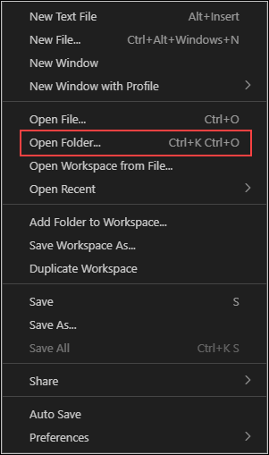

3. Now, navigate to `C:/Labfiles` **(1)** and select **function-app (2)** folder and then click on **Select Folder (3)**.

   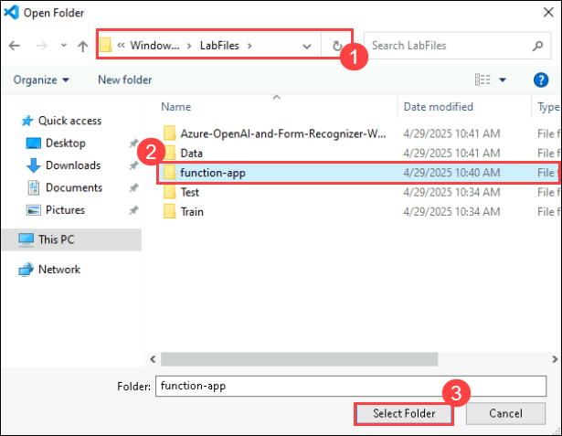

4. On the **Do you trust the authors of the files in this folder?** tab, select **Yes, I trust the authors**.

      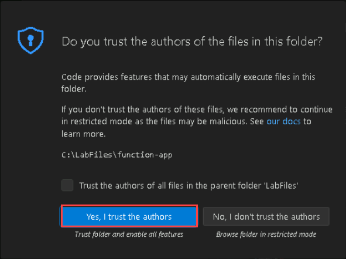

5. Select the **Azure symbol (1)** from the left pane, and click on **function-app icon (2)** and click **Create Function... (3)**

   

6. You'll be prompted to configure several settings:

   - Select the folder → choose **function-app**.

     
     
   - Select a language → choose **Python**.

     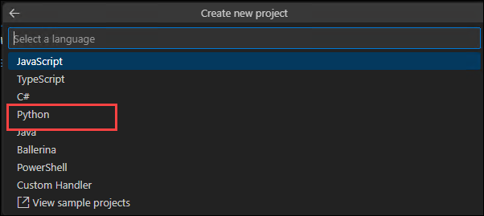

   - Select a Python interpreter to create a virtual environment → select **Python 3.11.9**.
     
     
   - Select a template → choose **Blob trigger** and give the trigger a name or accept the default name. Press **Enter** to confirm.

     

     

   - The path within your storage container that the trigger will monitor → type **input** and press **Enter**.

     

   - Select setting → choose **+ Create new local app setting** from the dropdown menu.

     

   - Click on **Sign in to Azure** and click on **Allow** if prompted. This will navigate to the Azure Portal and select your Azure Account.

     

     .png)

     - Email: <inject key="AzureAdUserEmail" enableCopy="true"></inject>

      - Password: <inject key="AzureAdUserPassword"></inject>
 
         .png)

         .png)

      - In the pop-up window click on **No, this app only**.

         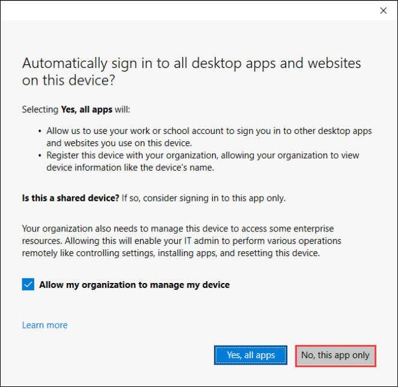

         >**Note:** If prompted, select subscription → choose the **Default Subscription**.

   - Select a storage account type for development → choose **Use Azure Storage for remote storage** and select **storage<inject key="Deployment ID" enableCopy="false"/>** → then select the name of the storage **input** container. Press **Enter** to confirm.

     

     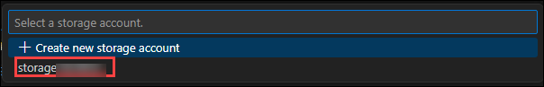

      >**Note:** If prompted, select how you would like to open your project → choose **Open the project in the current window** from the dropdown menu.

7. In VS Code, from the **Explorer (1)** in the left pane, navigate to the function's **requirements.txt (2)** file. This file defines the dependencies for your script. Add the following **Python packages (3)** to the file and press ` Ctrl + S ` to save:
   
      ```
      cryptography
      azure-functions
      azure-storage-blob
      azure-identity
      requests
      pandas
      numpy
      ```
      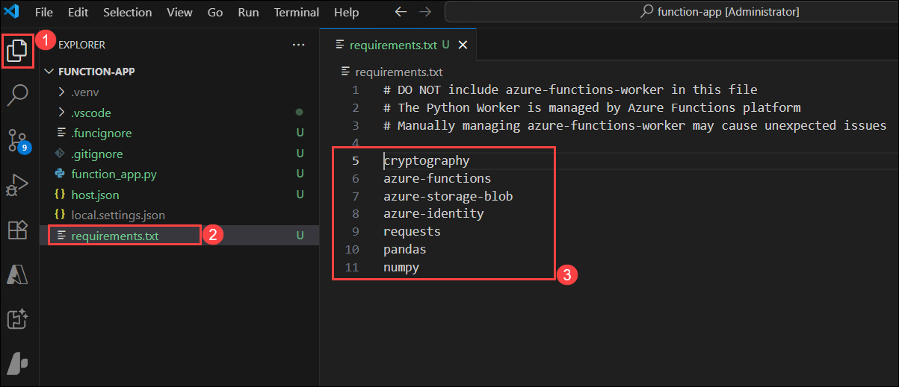

8. From the **Terminal**, please run `pip install -r requirements.txt` to install all the requirements.

      

9. Open the **local.settings.json** file and replace its contents with the configuration provided below, and press `Ctrl+S` to save.

      ```json
         {
        "IsEncrypted": false,
        "Values": {
          "AzureWebJobsStorage": "<Connection-string>",
          "FUNCTIONS_WORKER_RUNTIME": "python",
          "AzureWebJobsFeatureFlags": "EnableWorkerIndexing",
          "storageaccount-name_STORAGE": "<inject key="connectionString" enableCopy="false"/></inject>",
          "AzureWebJobsSecretStorageType": "Files"
        }
      }
      ```

   - Replace **AzureWebJobsStorage** value with the storage account connection string **<inject key="connectionString" enableCopy="false"/></inject>**
   - Update the configuration by adding **`"AzureWebJobsSecretStorageType": "Files"`** if it isn’t already included.
   - Replace **storageaccount-name** in storageaccount-name_STORAGE with **storage<inject key="Deployment ID" enableCopy="false"/>** and its value with the storage account connection string **<inject key="connectionString" enableCopy="false"/></inject>**


10. Open the **function-app.py (1)** file and add the following **import statements (2)** by replacing the existing ones:

      ```
      import logging
      from azure.storage.blob import BlobServiceClient
      import azure.functions as func
      import json
      import time
      from requests import get, post
      import os
      import requests
      from collections import OrderedDict
      import numpy as np
      import pandas as pd
      ```

      
   
11.  Update the main function by copying and pasting the code provided below, then replace the **path** and **connection** placeholders with the specified values.

     ```
      app = func.FunctionApp()
   
      @app.blob_trigger(arg_name="myblob", path="<container-name>", connection="<storage-account-name>_STORAGE")
   
      def blob_trigger(myblob: func.InputStream):
          logging.info(f"Python blob trigger function processed blob"
                      f"Name: {myblob.name}" 
                      f"Blob Size: {myblob.length} bytes")
      ``` 
      - path = **input**
      - connection = **storage<inject key="Deployment ID" enableCopy="false"/>_STORAGE**

         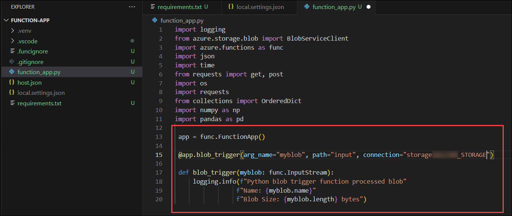

12. Add the following code block that calls the **Document Intelligence Analyze Layout API** on the uploaded document.
   - Replace **Your Document Intelligence Endpoint** : **<inject key="documentIntelligenceEndpoint"></inject>**.
   - Replace **Your Document Intelligence Key** : **<inject key="documentIntelligenceKey"></inject>**.
   - Replace `<model-name>` with **model**.

      ```
         # This is the call to the Document Intelligence endpoint
         endpoint = "Your Document Intelligence Endpoint"
         apim_key = "Your Document Intelligence Key"
         post_url = endpoint + "/formrecognizer/documentModels/<MODEL-NAME>:analyze?api-version=2023-07-31"
         source = myblob.read()
      
         headers = {
         # Request headers
         'Content-Type': 'application/pdf',
         'Ocp-Apim-Subscription-Key': apim_key,
            }
      ```

      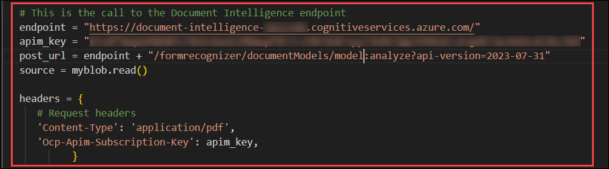
   
13. Next, add code to query the service and get the returned data.
      ```
         resp = requests.post(url=post_url, data=source, headers=headers)
      
         if resp.status_code != 202:
            print("POST analyze failed:\n%s" % resp.text)
            quit()
         print("POST analyze succeeded:\n%s" % resp.headers)
         get_url = resp.headers["operation-location"]
         
         wait_sec = 25
         time.sleep(wait_sec)
         # The layout API is async therefore the wait statement
         resp = requests.get(url=get_url, headers={"Ocp-Apim-Subscription-Key": apim_key})
         resp_json = json.loads(resp.text)
         status = resp_json["status"]
         
         if status == "succeeded":
            print("POST Layout Analysis succeeded:\n%s")
            results = resp_json
         else:
            print("GET Layout results failed:\n%s")
            quit()
         
         results = resp_json
      ```

14. Add the following code to connect to the Azure Storage output container.
   
    - Replace {storage-connection-string} : **<inject key="connectionString" enableCopy="false"/></inject>**

      ```
         # This is the connection to the blob storage, with the Azure Python SDK
         blob_service_client = BlobServiceClient.from_connection_string("{storage-connection-string}")
         container_client=blob_service_client.get_container_client("output")
      
         # Assuming `results` is your JSON data
         data = json.dumps(results)

         # Create a new blob and upload the data
         blob_name = myblob.name + ".json"
         blob_client = container_client.get_blob_client(blob_name)
         blob_client.upload_blob(data, overwrite=True)
      ```
      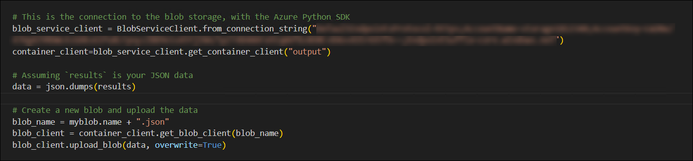

15. Please verify to ensure that the final code matches as below.

      ```
      import logging
      from azure.storage.blob import BlobServiceClient
      import azure.functions as func
      import json
      import time
      from requests import get, post
      import os
      import requests
      from collections import OrderedDict
      import numpy as np
      import pandas as pd
      
      app = func.FunctionApp()
      
      @app.blob_trigger(arg_name="myblob", path="<input container>", connection="storage<DID>_STORAGE") 
      
      def blob_trigger(myblob: func.InputStream):
         logging.info(f"Python blob trigger function processed blob"
                     f"Name: {myblob.name}"
                     f"Blob Size: {myblob.length} bytes")
      
         # This is the call to the Document Intelligence endpoint
         endpoint = "<document-intelligence-endpoint>"
         apim_key = "<document-intelligence-key>"
         post_url = endpoint + "/formrecognizer/documentModels/<model-name>:analyze?api-version=2023-07-31"
         source = myblob.read()
         
         headers = {
            # Request headers
            'Content-Type': 'application/pdf',
            'Ocp-Apim-Subscription-Key': apim_key,
                  }
         
         resp = requests.post(url=post_url, data=source, headers=headers)
      
         if resp.status_code != 202:
            print("POST analyze failed:\n%s" % resp.text)
            quit()
         print("POST analyze succeeded:\n%s" % resp.headers)
         get_url = resp.headers["operation-location"]
         
         wait_sec = 25
         time.sleep(wait_sec)
         # The layout API is async therefore the wait statement
         resp = requests.get(url=get_url, headers={"Ocp-Apim-Subscription-Key": apim_key})
         resp_json = json.loads(resp.text)
         status = resp_json["status"]
         
         if status == "succeeded":
            print("POST Layout Analysis succeeded:\n%s")
            results = resp_json
         else:
            print("GET Layout results failed:\n%s")
            quit()
         
         results = resp_json
      
         # This is the connection to the blob storage, with the Azure Python SDK
         blob_service_client = BlobServiceClient.from_connection_string("{storage-connection-string}")
         container_client=blob_service_client.get_container_client("output")
      
         # Assuming `results` is your JSON data
         data = json.dumps(results)
      
         # Create a new blob and upload the data
         blob_name = myblob.name + ".json"
         blob_client = container_client.get_blob_client(blob_name)
         blob_client.upload_blob(data, overwrite=True)
      ```
      > **Note:** Please make sure the indentation of the code remains unchanged and proper to run the code successfully

16. Under `.vscode` **(1)** folder, open the **launch.json (2)** and replace the entire code with the code given below and press `Ctrl+S` to save:

      ```
      {
         "version": "0.2.0",
         "configurations": [
            {
                  "name": "Python Debugger: Current File",
                  "type": "debugpy",
                  "request": "launch",
                  "program": "${file}",
                  "console": "integratedTerminal"
            },
            {
                  "name": "Attach to Python Functions",
                  "type": "debugpy",
                  "request": "attach",
                  "connect": {
                     "host": "localhost",
                     "port": 9091
                  },
                  "preLaunchTask": "func: host start"
            }
         ]
      }
      ```

      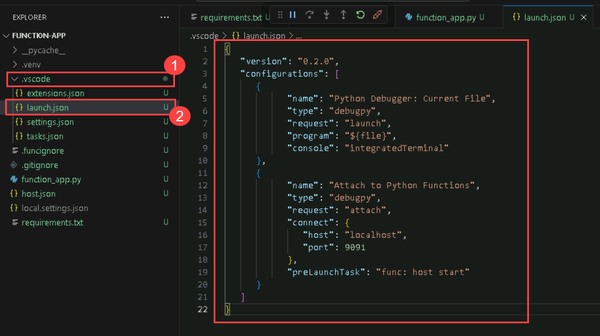

## Task 4: Run the Function App

In this task, you will run the function in VS Code, It uploads test invoices to the input container in the Azure Storage account to trigger the function. Finally, it verifies the output JSON files in the output container to confirm successful document analysis.

1. In Visual Studio Code, click the **ellipsis (**...**)** in the top menu, then expand **Terminal (1)** and select **New Terminal (2)** from the dropdown. 

   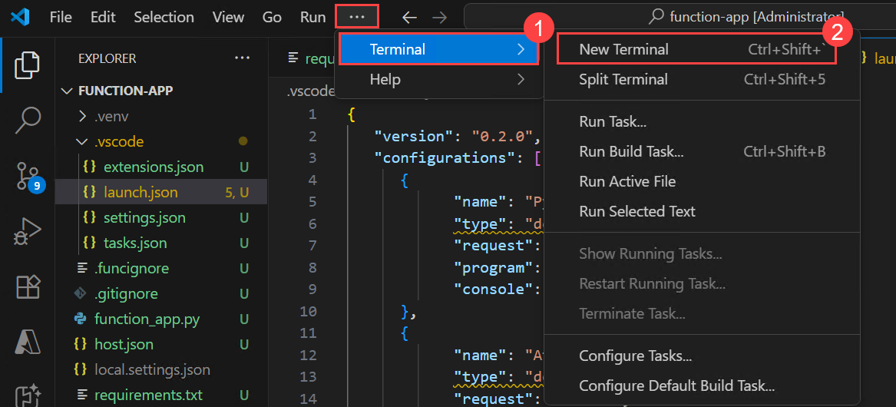

1. Press **Ctrl + F5** to run the function.

   > **Note:** If a debugger error appears, click **Debug Anyway**, then in the next pop-up, choose **Install debugpy Extension**. This will take you to the extension page, click **Install** to set up the **Python Debugger**. 

      .png)

      2.png)

      

   > **Note:** Install the Python packages if required.

   > **Note**: If any pop-up occurs, close it.

      

1. Once the function has been run successfully, navigate to `portal.azure.com` when it triggers to add an input file as shown below.

   

1. In the search bar, search and select **Storage Account** under **Services**.

   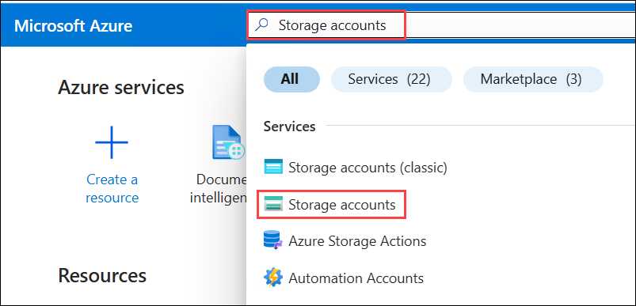

1. Select **storage<inject key="Deployment ID" enableCopy="false"/>** from the Storage accounts blade.

   

1. In the storage account **storage<inject key="Deployment ID" enableCopy="false"/>**, under the **Data Storage (1)** tab, navigate to **Containers (2)** and select **input (3)** container.

   
   
1. In the input container, click on **Upload (1)** button, in the **Upload blob** pop-up window click on **Browse for files (2)**.

   

1. Navigate to `C:\LabFiles\Test` **(1)**, select **Invoice_6 and Invoice_7** **(2)**, and click on **Open (3)**.

   

   
1. In the **Upload blob** pop-up window, click on **Upload** button.

   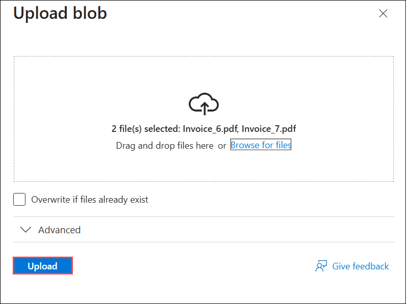

1. Navigate back to the **VS code** and verify the **logs** in the **Terminal**.

1. Once the function app is triggered successfully, navigate back to the **storage account**.

1. In the storage account, go to the **Data Storage (1)** section, click on **Containers (2)**, and then choose the **Output (3)** container.
   
   

1. In the **Output** container, click on the **input** folder and verify the **json** analysing the document has been generated successfully.

   

>**Congratulations** on completing the Task! Now, it's time to validate it. Here are the steps:
> - Hit the Validate button for the corresponding task. If you receive a success message, you have successfully validated the lab. 
> - If not, carefully read the error message and retry the step, following the instructions in the lab guide.
> - If you need any assistance, please contact us at cloudlabs-support@spektrasystems.com.

<validation step="44d3193c-9401-4326-a2f5-067cf63f0c54" />

## Task 5: Working with AI Search

In this task, you connects Azure AI Search to the output container in Blob Storage to index analyzed document data. It configures the index and indexer so fields like Organization and Address are searchable and facetable. Finally, it verifies the indexed data by running a search and confirming the trained fields appear correctly.

1. In the Azure Portal, type **AI Search** in the search bar and choose it from the **Services** section.

      
   
1. In **AI foundry | AI Search** tab, select **search-<inject key="Deployment ID" enableCopy="false"/>**.

      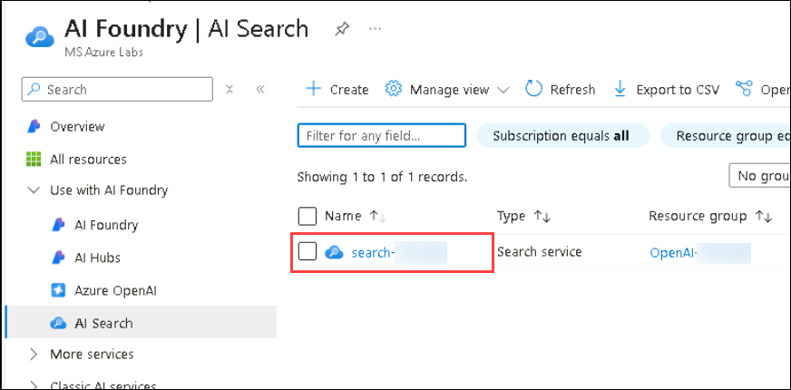
   
1. In the Overview page of **search-<inject key="Deployment ID" enableCopy="false"/>**, click on **Import data**.

      

1. Provide the following values:

      - Data Source: **Azure Blob Storage (1)**
      - Data Source Name: **data-source-<inject key="Deployment ID" enableCopy="false"/> (2)**
      - Parsing Mode: **JSON (3)**
      - Subscription: **Select the default subscription (4)**
      - Connection string: Click on **Choose an existing Connection** then Select **storage<inject key="Deployment ID" enableCopy="false"/>** and then select **output** container **(5)**.
      - Container Name: **output (6)**
      - Blob Folder: **input (7)**
      - Click on **Next: Add cognitive skills (Optional) (8)**
     
        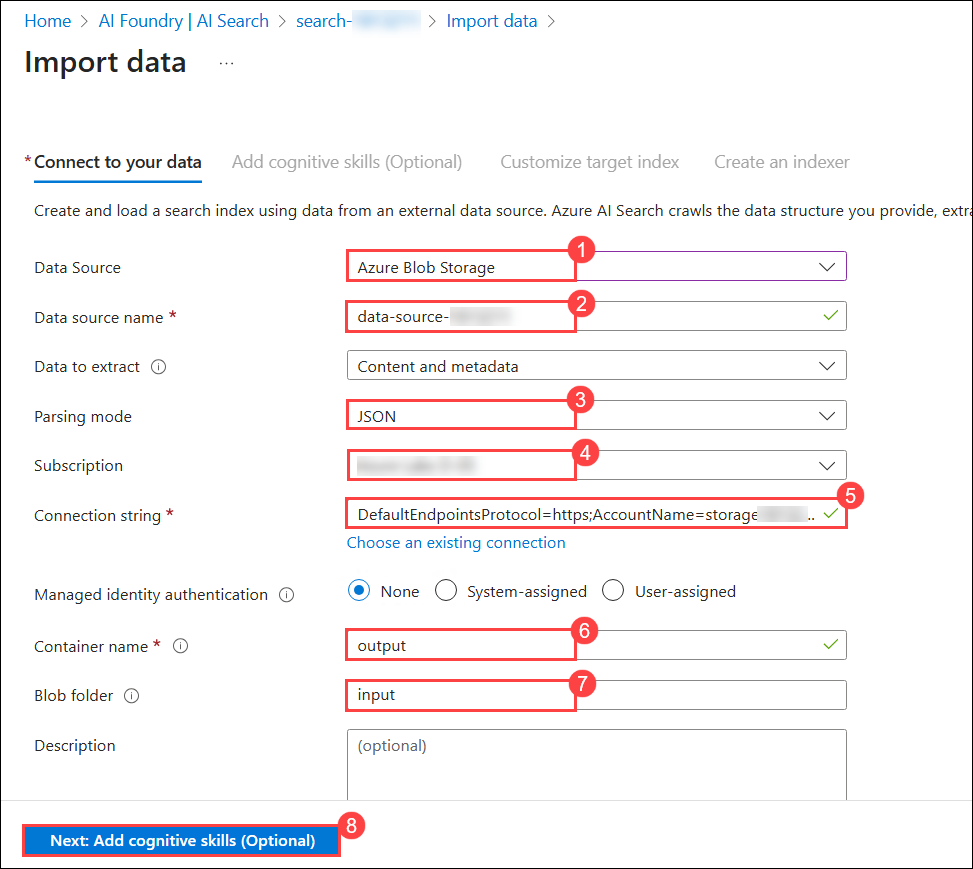

1. On the **Add cognitive skills (Optional)**, click on **Skip to : Customize target index**.

1. On the **Customize target index**, enter Index name as **azureblob-index** **(1)**, make all fields **Retrievable** **(2)**, and **Searchable** **(3)**.

      

1. Expand the **AnalyzeResult** **(1)** > **documents** **(2)** > **fields** **(3)** , expand **Organization** and **Address** and make the two fields Facetable **(type, valueString & content)** **(6)** and click on **Next: Create an indexer**.

      
      
1. On the **Create an indexer** page, enter the name as **azureblob-indexer** **(1)** and click on **Submit** **(2)**.
   
      

1. Under the **Search management (1)** tab, select **Indexes (2)** and then click on **azureblob-index (3)**.

      

1. In the **azureblob-index**, click on **Search** button.

      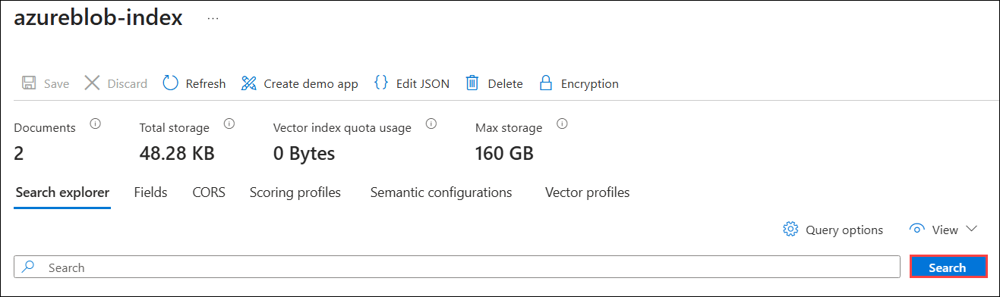

1. Verify the document that has been analysed.

      

1. Search for `fields` and verify the fields **Organization and Address**, given while training, the document has been analysed.

   

   

## Summary

In this lab, you used Azure services to automate document processing by creating a **Document Intelligence** resource and training a custom model for data extraction. You then developed an **Azure Function App** to process documents from Blob Storage, analyze them via the Document Intelligence API, and store results as JSON files. Lastly, you set up Azure AI Search to index and search the analyzed documents, integrating these components for efficient document management.

### Click on Next >> to proceed with the next Lab.
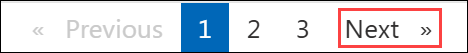
