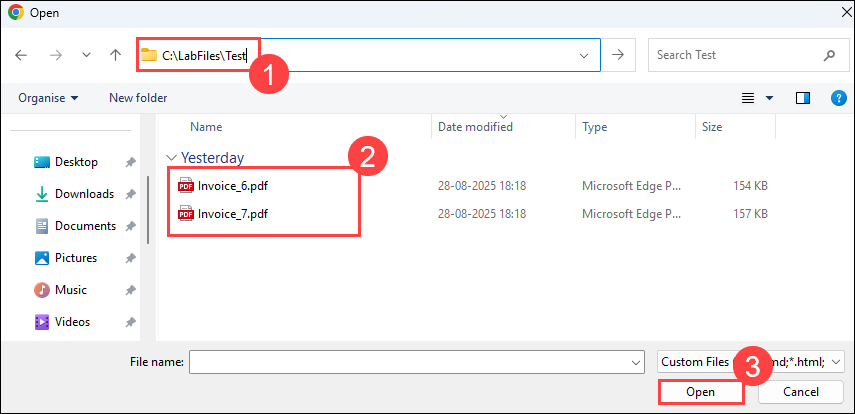
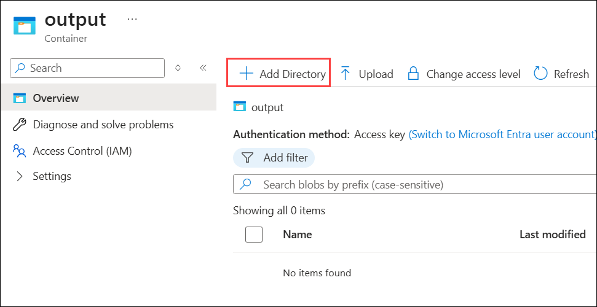
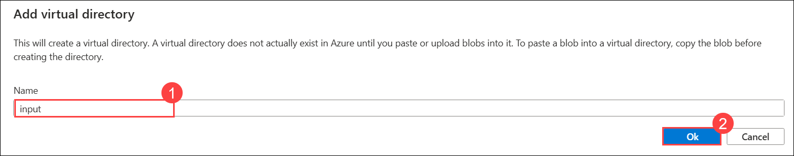
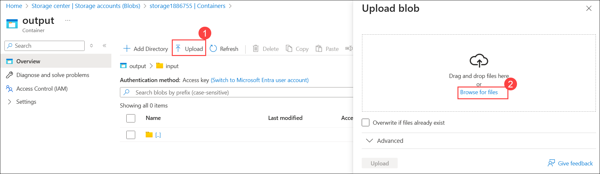
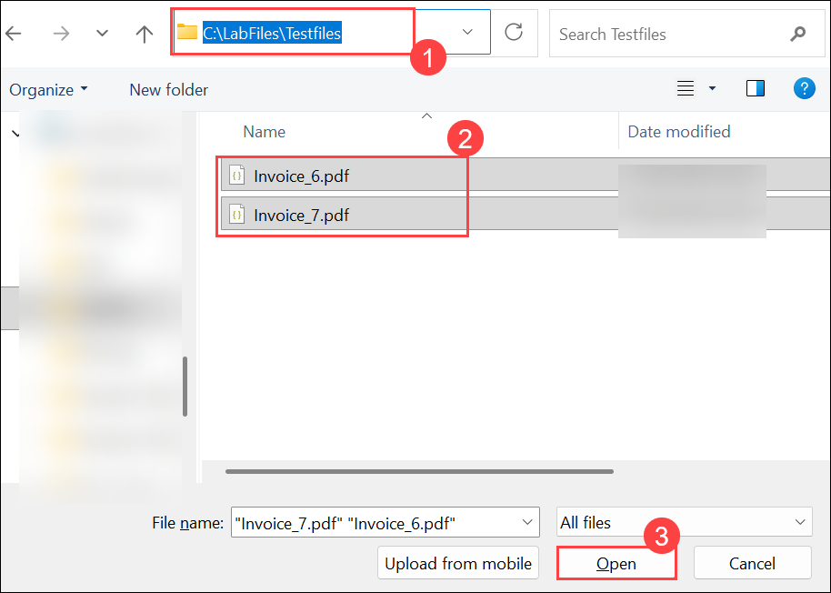
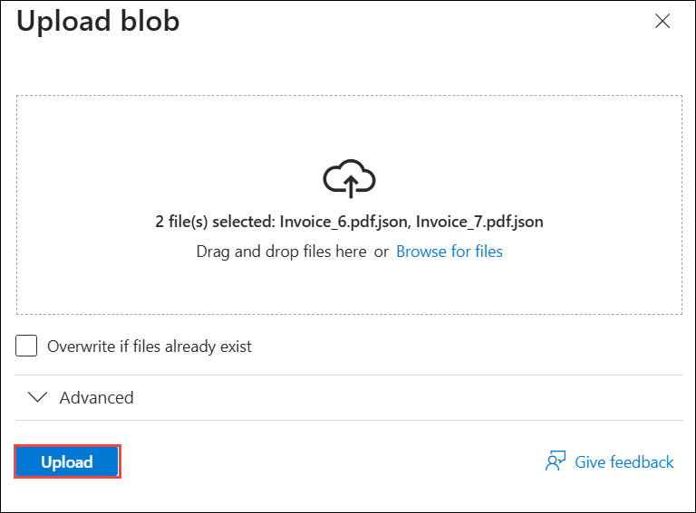

# Lab 01: Automate Document Processing using Azure AI Document Intelligence

### Estimated Duration: 120 Minutes

## Overview

In this lab, you will explore how Azure simplifies document processing by automating data extraction and analysis. Using Azure AI Document Intelligence, you'll train models to extract information from documents such as PDFs, images, and forms. You'll also integrate Azure Function Apps to enable scalable, programmatic processing of documents.

## Architecture Diagram

   

## Lab Objectives

You will be able to complete the following tasks:

- Task 1: Creating a Document Intelligence Resource
- Task 2: Train and Label data
- Task 3: Creation of Function App
- Task 4: Run the Function App
- Task 5: Working with AI Search

### Task 1: Creating a Document Intelligence Resource

In this task, you will set up the Document Intelligence environment in Azure so you can build and train a custom document extraction model. It creates a project in Document Intelligence Studio, connects it to the correct Azure resource, and links a storage location for training data. By the end, you have a fully configured project ready for model training.

1. In the Azure portal, enter **Document Intelligence (1)** in the top search bar and select **Document Intelligence (2)** from the Services list.

   

1. Navigate to **document-intelligence-<inject key="Deployment ID" enableCopy="false"/>**.

   

1. In the **Overview (1)** pane, scroll down to the **Get Started** section and click **Go to Document Intelligence Studio (2)**.

   

   >**Note:** If prompted, sign in using the same credentials you used to log in to Azure.

1. On the **Document Intelligence Studio** page, scroll to **Custom models** and click **Get started** under **Custom extraction model**. 

   

   >**Note:** If prompted, log in using the below Azure credentials.

1. On the **Sign in** tab, you will see the login screen. Enter the following email/username, and click on **Next (2)**. 

   * **Email/Username:** <inject key="AzureAdUserEmail"></inject> **(1)**
   
      
     
1. Now enter the following password and click on **Sign in (2)**.
   
   * **Password:** <inject key="AzureAdUserPassword"></inject> **(1)**
   
      

1. Under **My Projects** blade, click on **+ Create a project**.

   .png)

1. Under **Enter project details**, provide the following details, then click **Continue (3)**.

   - Project name: **testproject** **(1)**.
   - Description: **Custom model project** **(2)**.

     

1. Under **Configure service resource**, provide the following details, then click **Continue (5)**.

   - Subscription: Select your **Default Subscription** **(1)**.
   - Resource group: **OpenAI-<inject key="Deployment ID" enableCopy="false"/>** **(2)**.
   - Document Intelligence or Cognitive Service Resource: Select **document-intelligence-<inject key="Deployment ID" enableCopy="false"/>** **(3)**.
   - API version: Select **2024-11-30 (4.0 General Availability)** **(4)**.

     

1. Enter the following details for **Connect training data source** and click on **Continue** **(5)**.

   - Subscription: Select your **Default Subscription** **(1)**.
   - Resource group: **OpenAI-<inject key="Deployment ID" enableCopy="false"/>** **(2)**.
   - Storage account: Select **storage<inject key="Deployment ID" enableCopy="false"/>** **(3)**.
   - Blob container: **analysis** **(4)**.
   
        

1. Review the project configuration details and click **Create project**.

     

### Task 2: Train and Label data

In this task, you will upload and label training documents to create a custom model, then train and test the model using labeled invoice data.

1. In the Label data section, click **Browse for files** to upload your training documents.

     

1. In the file explorer, enter the path `C:\LabFiles\Train` **(1)** and press **Enter**, select all **PDF files (2)** (Invoice_1 to Invoice_5) in the folder, then click **Open (3)**.

   .png)

1. Once uploaded, choose **Run now** in the pop-up window under **Run layout**.

     

1. Click **+ Add a field (1)**, select **Field (2)**, enter **Organization (3)** as the field name, and press **Enter**.

     

     

1. Follow the steps below:

   - Select **Invoice_1.pdf (1)** from the left pane.

   - Highlight **Contoso (2)** in the document.

   - From the prompt, choose **Organization (3)** to label the field. 
   
   - A green checkmark will appear next to **Invoice_1.pdf** indicating successful labeling.

     

1. Click on **+ Add a field** **(1)**, select **Field** **(2)**, enter the field name as **Address** **(3)** and hit **enter**.

     

   

1. Highlight the **address (1)** text and assign it to the **Address (2)** field.

   

1. Repeat **step 5** and **step 7** for all five documents to ensure all fields are properly labeled.

1. Once all the documents are labeled, click on **Train** in the top right corner.

     

1. In the **Train a new model** window, enter **model (1)** as Model ID, **custom model (2)** as Model Description (2), choose **Template (3)** as Build Mode, and click **Train (4)**.

     

1. In **Training in process** pop-up window, click on **Go to Models**. 

   
   
1. Wait until the model status shows **Succeeded**. Once it does, select the model **model (1)** you created and click on **Test (2)**.

     

1. On the **Test model** window, click on **Browse for files**. 

     

1. On the file explorer, enter the path `C:\LabFiles\Test` **(1)**, press **Enter**, select the test PDF files **Invoice_6 and Invoice_7 (2)**, and click **Open (3)**.

      

1. Once uploaded, select a test document and click **Run analysis**. On the right-hand side, you will see the detected fields **Organization** and **Address** along with their confidence scores.

   
   
### Task 3: Storage account

1. In the search bar, search for **Storage Account (1)** and select **Storage Account (2)** under Services.

   

1. Select **storage<inject key="Deployment ID" enableCopy="false"/>** from the Storage accounts blade.

   

1. From the left navigation pane, expand **Data storage (1)**, select **Containers (2)**, then open the **input (3)** container.

   
   
1. In the input container, click on **Upload (1)** button, in the **Upload blob** pop-up window click on **Browse for files (2)**.

   

1. Navigate to `C:\LabFiles\Test` **(1)**, select **Invoice_6 and Invoice_7 (2)**, then click **Open (3)** to upload the files.

   
   
1. In the **Upload blob** pop-up window, click on **Upload** button.

   

1. From the left navigation pane, expand **Data storage (1)**, select **Containers (2)**, then open the **output (3)** container

   

1. Select **+ Add directory**.

   

1. Provide the name as **input (1)** and then **OK (2)**.

   

1. In the output container, click on **Upload (1)** button, in the **Upload blob** pop-up window click on **Browse for files (2)**.

      

1. Navigate to `C:\LabFiles\Testfiles` **(1)**, select **Invoice_6.pdf and Invoice_7.pdf (2)**, then click **Open (3)** to upload the files.

    

1. In the **Upload blob** pop-up window, click on **Upload** button.

        

>**Congratulations** on completing the Task! Now, it's time to validate it. Here are the steps:
> - Hit the Validate button for the corresponding task. If you receive a success message, you have successfully validated the lab. 
> - If not, carefully read the error message and retry the step, following the instructions in the lab guide.
> - If you need any assistance, please contact us at cloudlabs-support@spektrasystems.com.

<validation step="44d3193c-9401-4326-a2f5-067cf63f0c54" />

### Task 4: Working with AI Search

In this task, you will connect Azure AI Search to Blob Storage to index analyzed document data. You will configure the search index and indexer to make key fields like Organization and Address searchable and facetable, then verify the indexed data by running search queries.

1. In the Azure portal, enter **AI Search (1)** in the top search bar and select **AI Search (2)** from the Services list.

      
   
1. In **AI foundry | AI Search** tab, select **search-<inject key="Deployment ID" enableCopy="false"/>**.

      
   
1. In the Overview page of **search-<inject key="Deployment ID" enableCopy="false"/>**, click on **Import data** from the top menu bar.

      

1. Provide the following values:

      - Data Source: **Azure Blob Storage (1)**.
      - Data Source Name: **data-source-<inject key="Deployment ID" enableCopy="false"/> (2)**.
      - Parsing Mode: **JSON (3)**.
      - Subscription: Select the **Default subscription (4)**.
      - Connection string: Click on **Choose an existing connection (5)**.

        

      - From the left pane, select **storage<inject key="Deployment ID" enableCopy="false"/> (6)**, then select **output (7)** container, and click **Select (8)** at the bottom.

        

      - Container Name: **output (9)**
      - Blob Folder: **input (10)**
      - Click on **Next: Add cognitive skills (Optional) (11)**
     
        

1. On the **Add cognitive skills (Optional)** page, click **Skip to: Customize target index** at the bottom.

      

1. On the **Customize target index** page, set the Index name to **azureblob-index (1)**, and ensure all fields are marked as **Retrievable (2)** and **Searchable (3)**.

      

1. On the **Import data** page, expand **analyzeResult (1)** > **documents (2)** > **fields (3)**, then expand **Organization (4)** and check the Facetable boxes for **type, valueString, and content (5)**; do the same for **Address (6)** fields **type, valueString, and content (7)**, then click **Next: Create an indexer (8)**.

      

      
      
1. On the **Create an indexer** page, enter the name as **azureblob-indexer** **(1)** and click on **Submit** **(2)** at the bottom.
   
      

1. From the left navigation pane, expand **Search management (1)**, select **Indexes (2)**, then click **azureblob-index (3)**.

      

1. In the **azureblob-index**, click on the **Search** button next to the search bar.

      

1. Verify the document that has been analysed.

      

1. Search for `fields` in the document and verify that the **Organization** and **Address** fields, created during training, have been correctly analyzed.

      

      

## Summary

In this lab, you have completed the following:

- Created a Document Intelligence resource.
- Trained and labeled data for document analysis.
- Developed and deployed an Azure Function App.
- Executed the Function App to process documents.
- Integrated and explored AI-powered search capabilities.

### You have successfully completed the lab. Now, click on **Next >>** from the lower right corner to proceed on to the next lab.

