# Lab 01: Automate Document Processing using Azure AI Document Intelligence

### Estimated Duration: 120 Minutes

## Overview

In this lab, you will explore how Azure simplifies document processing by automating data extraction and analysis. Using Azure AI Document Intelligence, you'll train models to extract information from documents such as PDFs, images, and forms. You'll also integrate Azure Function Apps to enable scalable, programmatic processing of documents.

## Architecture Diagram

   

## Lab Objectives

You will be able to complete the following tasks:

- Task 1: Creating a Document Intelligence Resource
- Task 2: Train and Label data
- Task 3: Creation of Function App
- Task 4: Run the Function App
- Task 5: Working with AI Search

## Task 1: Creating a Document Intelligence Resource

In this task, you will set up the Document Intelligence environment in Azure so you can build and train a custom document extraction model. It creates a project in Document Intelligence Studio, connects it to the correct Azure resource, and links a storage location for training data. By the end, you have a fully configured project ready for model training.

1. In the Azure portal, enter **Document Intelligence (1)** in the top search bar and select **Document Intelligence (2)** from the Services list.

   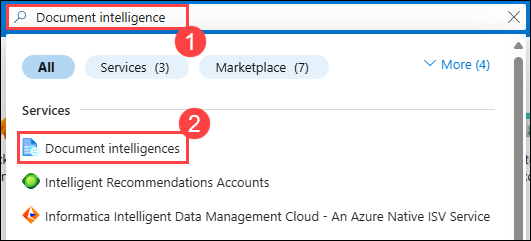

1. Navigate to **document-intelligence-<inject key="Deployment ID" enableCopy="false"/>**.

   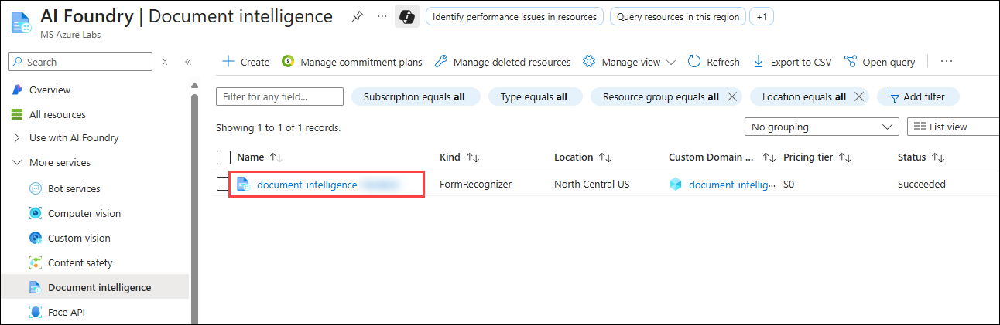

1. In the **Overview (1)** pane, scroll down to the **Get Started** section and click **Go to Document Intelligence Studio (2)**.

   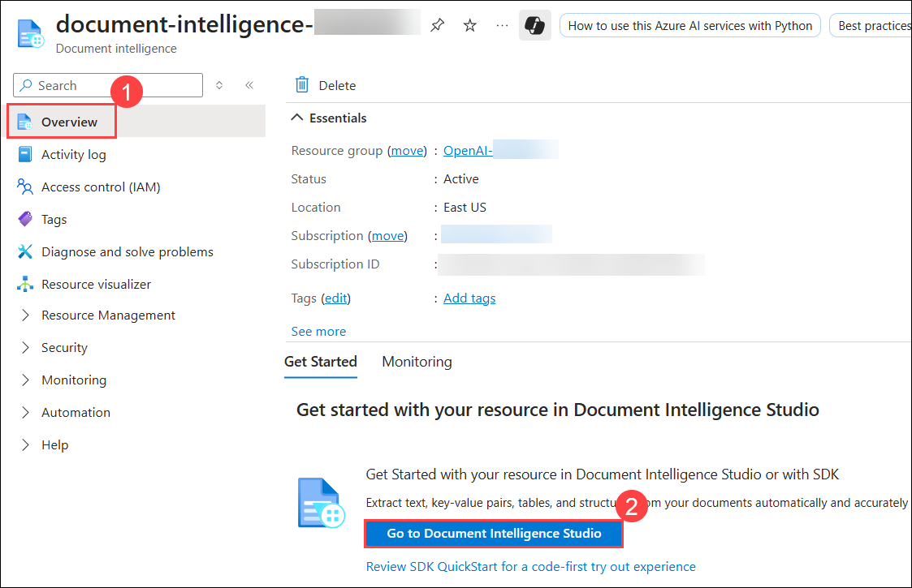

   >**Note:** If prompted, sign in using the same credentials you used to log in to Azure.

1. On the **Document Intelligence Studio** page, scroll to **Custom models** and click **Get started** under **Custom extraction model**. 

   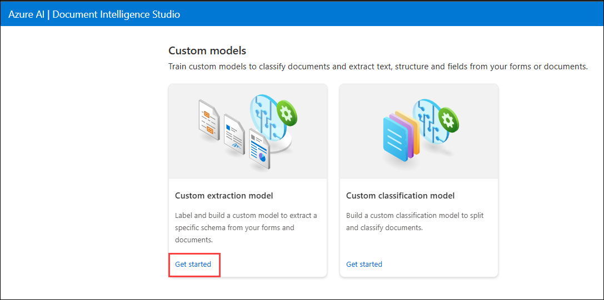

   >**Note:** If prompted, log in using the below Azure credentials.

1. On the **Sign in** tab, you will see the login screen. Enter the following email/username, and click on **Next (2)**. 

   * **Email/Username:** <inject key="AzureAdUserEmail"></inject> **(1)**
   
      
     
1. Now enter the following password and click on **Sign in (2)**.
   
   * **Password:** <inject key="AzureAdUserPassword"></inject> **(1)**
   
      

1. Under **My Projects** blade, click on **+ Create a project**.

   .png)

1. Under **Enter project details**, provide the following details, then click **Continue (3)**.

   - Project name: **testproject** **(1)**.
   - Description: **Custom model project** **(2)**.

     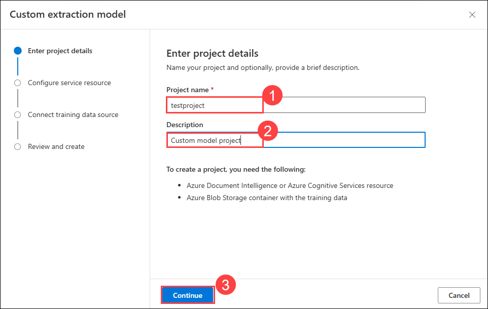

1. Under **Configure service resource**, provide the following details, then click **Continue (5)**.

   - Subscription: Select your **Default Subscription** **(1)**.
   - Resource group: **OpenAI-<inject key="Deployment ID" enableCopy="false"/>** **(2)**.
   - Document Intelligence or Cognitive Service Resource: Select **document-intelligence-<inject key="Deployment ID" enableCopy="false"/>** **(3)**.
   - API version: Select **2024-11-30 (4.0 General Availability)** **(4)**.

     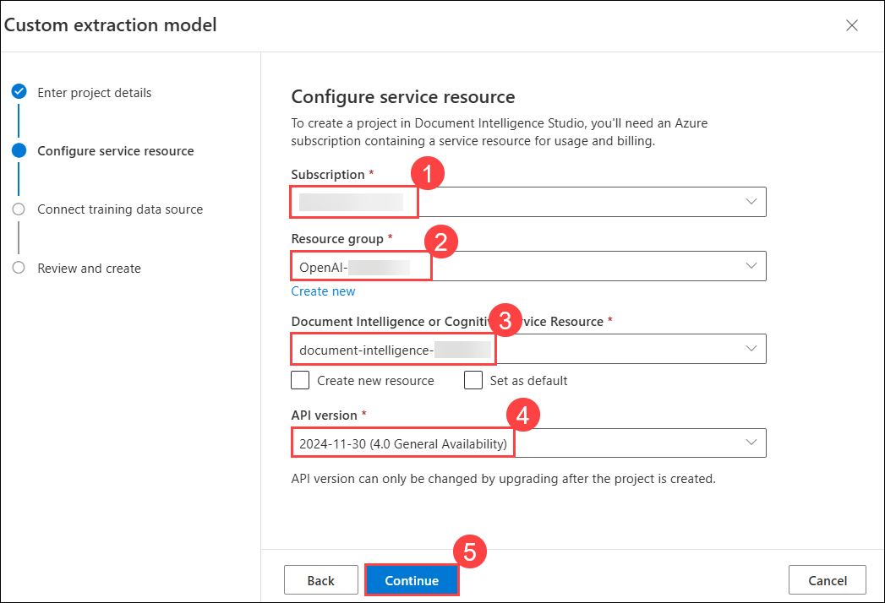

1. Enter the following details for **Connect training data source** and click on **Continue** **(5)**.

   - Subscription: Select your **Default Subscription** **(1)**.
   - Resource group: **OpenAI-<inject key="Deployment ID" enableCopy="false"/>** **(2)**.
   - Storage account: Select **storage<inject key="Deployment ID" enableCopy="false"/>** **(3)**.
   - Blob container: **analysis** **(4)**.
   
        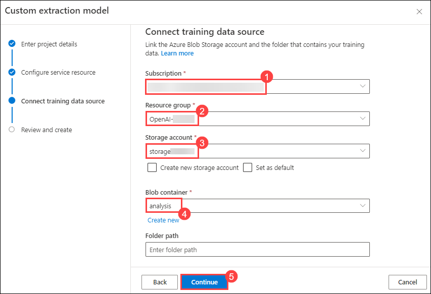

1. Review the project configuration details and click **Create project**.

     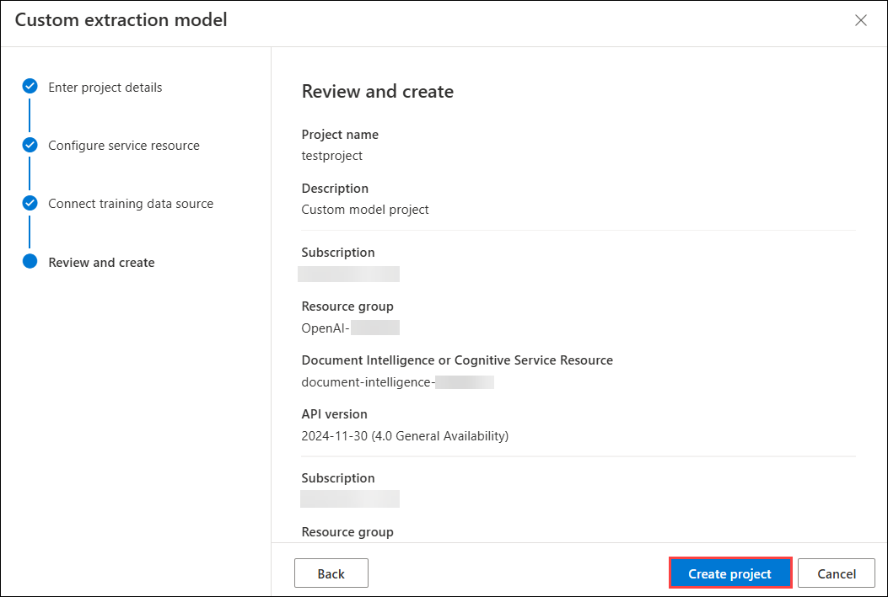

## Task 2: Train and Label data

In this task, you will upload and label training documents to create a custom model, then train and test the model using labeled invoice data.

1. In the Label data section, click **Browse for files** to upload your training documents.

     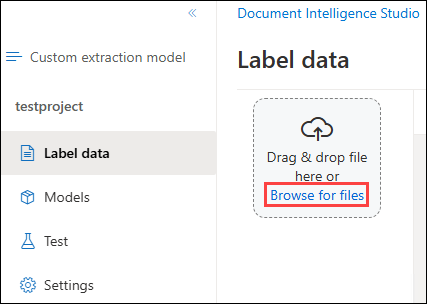

1. In the file explorer, enter the path `C:\LabFiles\Train` **(1)** and press **Enter**, select all **PDF files (2)** (Invoice_1 to Invoice_5) in the folder, then click **Open (3)**.

   .png)

1. Once uploaded, choose **Run now** in the pop-up window under **Run layout**.

     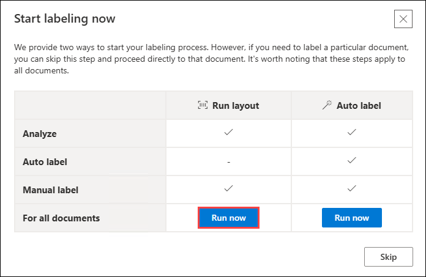

1. Click **+ Add a field (1)**, select **Field (2)**, enter **Organization (3)** as the field name, and press **Enter**.

     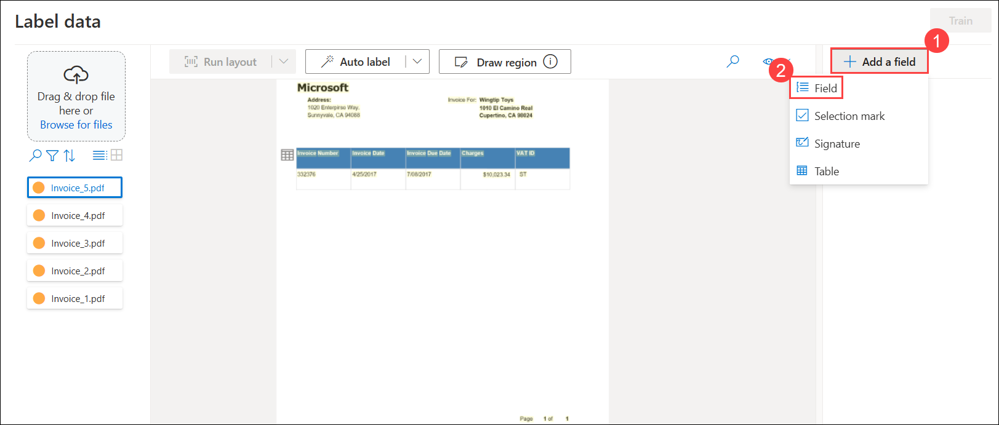

     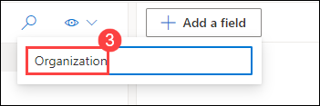

1. Follow the steps below:

   - Select **Invoice_1.pdf (1)** from the left pane.

   - Highlight **Contoso (2)** in the document.

   - From the prompt, choose **Organization (3)** to label the field. 
   
   - A green checkmark will appear next to **Invoice_1.pdf** indicating successful labeling.

     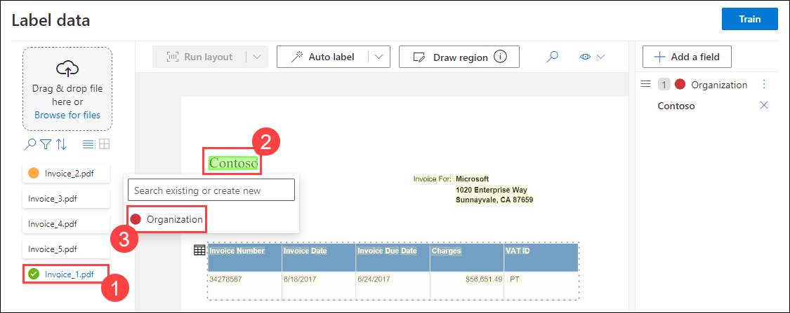

1. Click on **+ Add a field** **(1)**, select **Field** **(2)**, enter the field name as **Address** **(3)** and hit **enter**.

     

   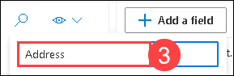

1. Highlight the **address (1)** text and assign it to the **Address (2)** field.

   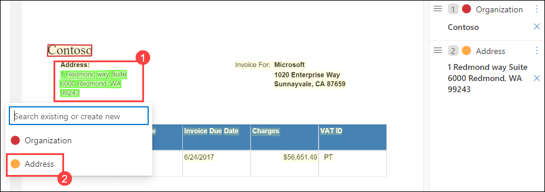

1. Repeat **step 5** and **step 7** for all five documents to ensure all fields are properly labeled.

1. Once all the documents are labeled, click on **Train** in the top right corner.

     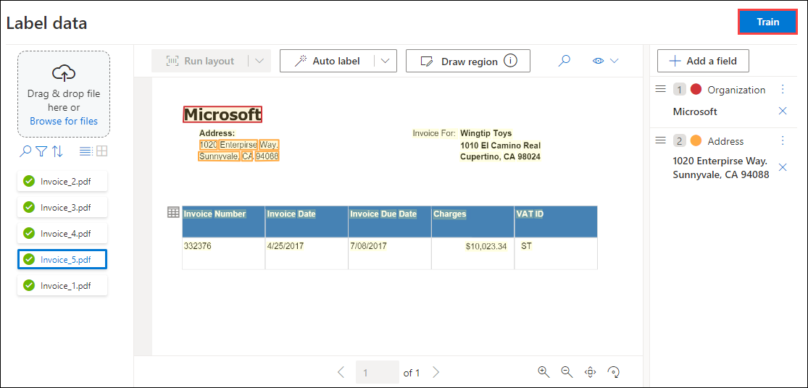

1. In the **Train a new model** window, enter **model (1)** as Model ID, **custom model (2)** as Model Description (2), choose **Template (3)** as Build Mode, and click **Train (4)**.

     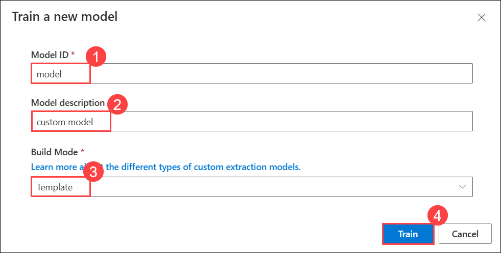

1. In **Training in process** pop-up window, click on **Go to Models**. 

   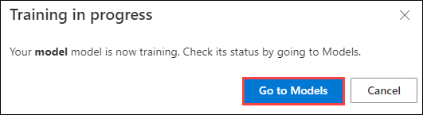
   
1. Wait until the model status shows **Succeeded**. Once it does, select the model **model (1)** you created and click on **Test (2)**.

     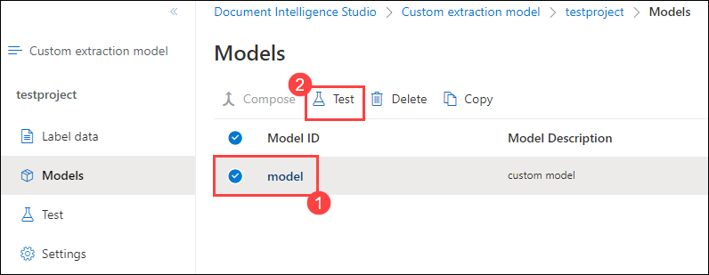

1. On the **Test model** window, click on **Browse for files**. 

     

1. On the file explorer, enter the path `C:\LabFiles\Test` **(1)**, press **Enter**, select the test PDF files **Invoice_6 and Invoice_7 (2)**, and click **Open (3)**.

      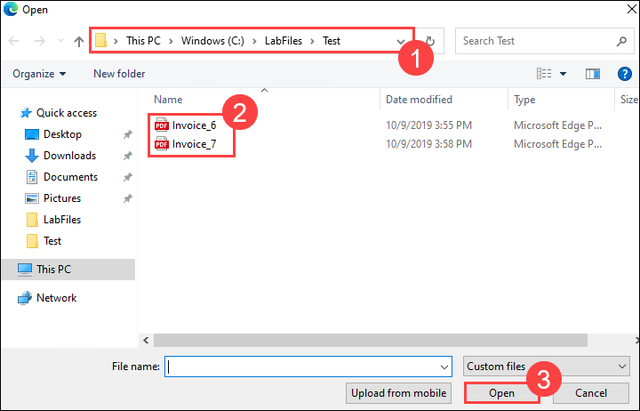

1. Once uploaded, select a test document and click **Run analysis**. On the right-hand side, you will see the detected fields **Organization** and **Address** along with their confidence scores.

   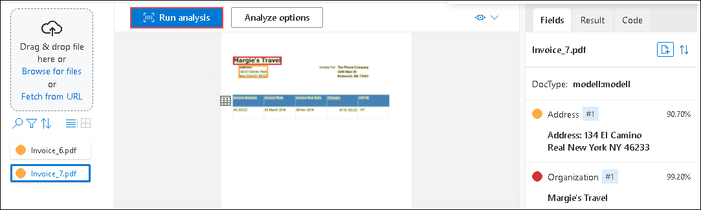
   
## Task 3: Creation of Function App

In this task, you will be using Azure Functions to process documents that are uploaded to an Azure blob storage container. This workflow extracts table data from stored documents using the Document Intelligence layout model and saves the data in a JSON file in Azure.
   
1. Open **Visual Studio Code** on the **Lab VM** by double-clicking the icon on the desktop.

   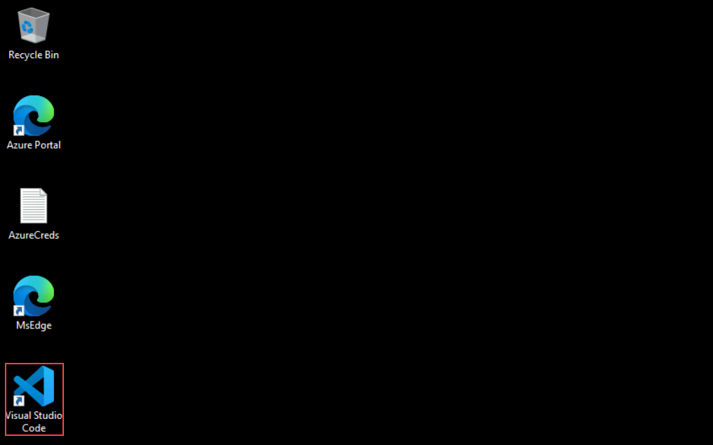

1. In Visual Studio Code, navigate to the **File (1)** from the top menu bar and select **Open Folder... (2)**.

   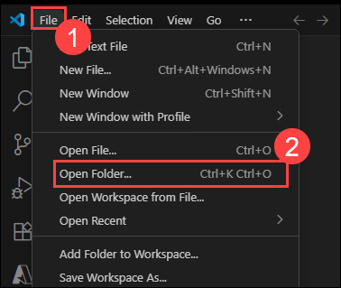

1. Now, navigate to `C:/Labfiles` **(1)** and select **function-app (2)** folder and then click on **Select Folder (3)**.

   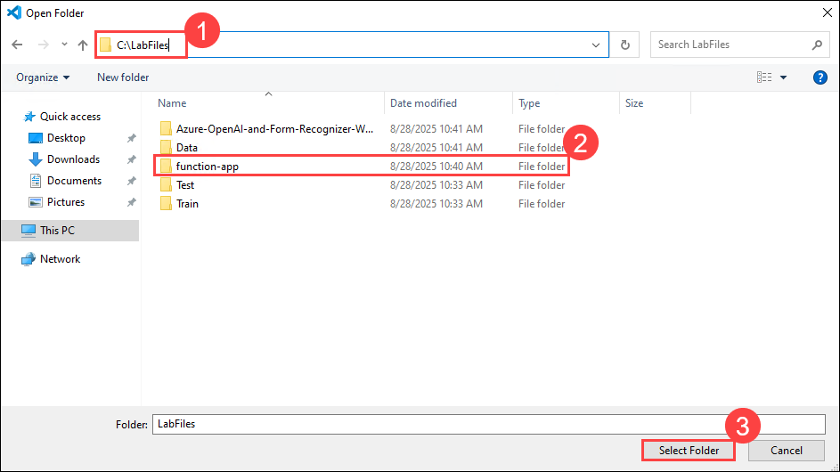

1. On the **Do you trust the authors of the files in this folder?** tab, select **Yes, I trust the authors**.

   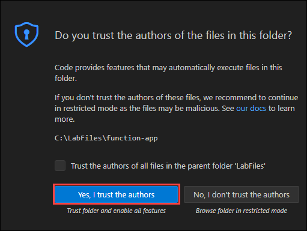

1. Select the **Azure symbol (1)** from the left pane, and click on **function-app icon (2)** and click **Create Function... (3)**

   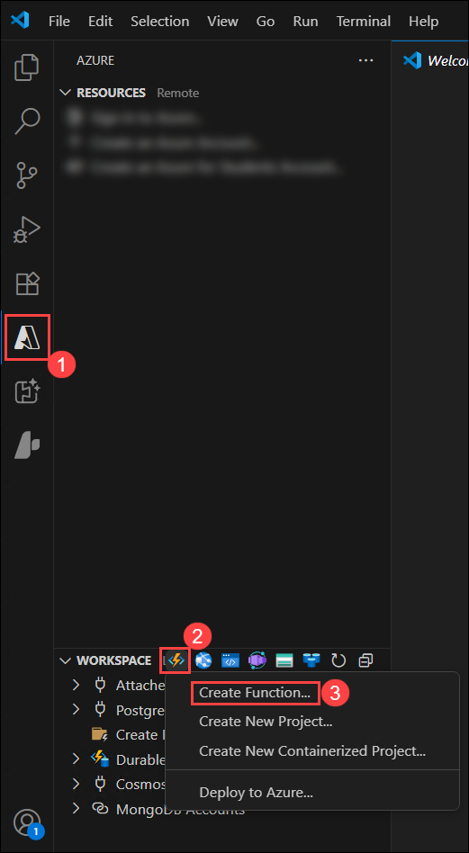

1. You'll be prompted to configure several settings:

   - Select the folder → choose **function-app**.

     
     
   - Select a language → choose **Python**.

     

   - Select a Python interpreter to create a virtual environment → select **python 3.11.9**.
     
     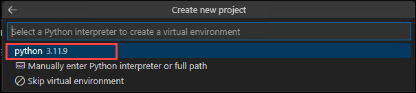

   - Select a template for your project's first function → choose **Blob trigger** and give the trigger a name or accept the default name. Press **Enter** to confirm.

     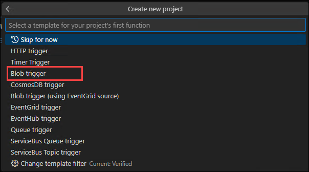

     

   - The path within your storage container that the trigger will monitor → type **input** and press **Enter**.

     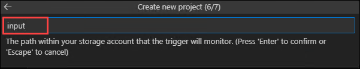

   - Select the app setting → choose **+ Create new local app setting** from the dropdown menu.

     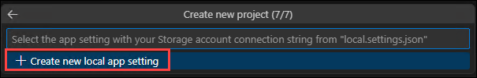

   - Click on **Sign in to Azure**.

     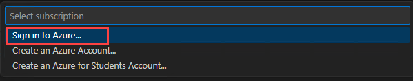

   - Click on **Allow** if prompted. This will navigate to the Azure Portal and select your Azure Account.

     .png)

     - Enter Email: <inject key="AzureAdUserEmail" enableCopy="true"></inject> **(1)** and click **Next (2)**.

         

     - Enter Password: <inject key="AzureAdUserPassword"></inject> **(1)** and click **Sign in (2)**.

         

     - In the pop-up window, select **No, this app only**.

         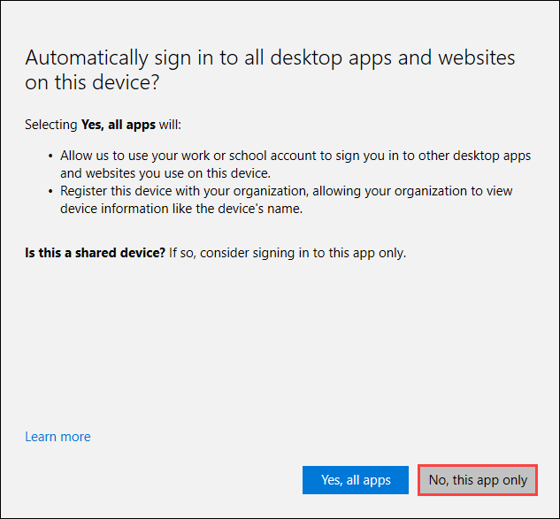

         >**Note:** If prompted, select subscription → choose the **Default Subscription**.

   - Select a storage account type for development → choose **Use Azure Storage for remote storage** and select **storage<inject key="Deployment ID" enableCopy="false"/>** → then select the name of the storage **input** container. Press **Enter** to confirm.

     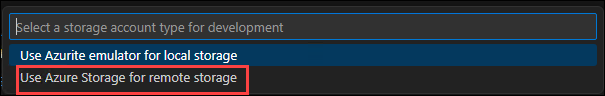

     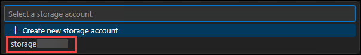

      >**Note:** If prompted, select how you would like to open your project → choose **Open the project in the current window** from the dropdown menu.

1. In VS Code, from the **Explorer (1)** in the left pane, navigate to the **requirements.txt (2)** file. This file defines the dependencies for your script. Add the following **Python packages (3)** to the file and press `Ctrl + S` to save:
   
      ```
      cryptography
      azure-functions
      azure-storage-blob
      azure-identity
      requests
      pandas
      numpy
      ```
      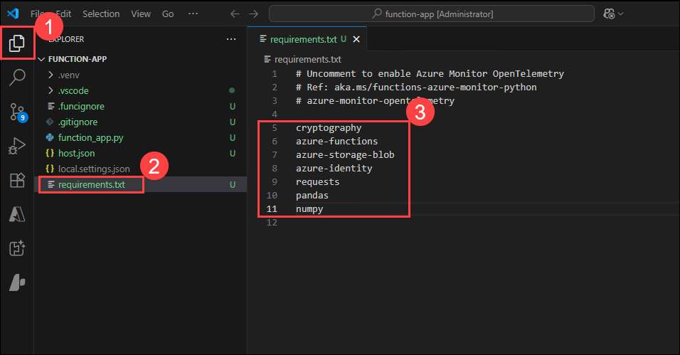

1. Click the **ellipsis (⋯) (1)** from the top menu bar, go to **Terminal (2)**, and select **New Terminal (3)**.

      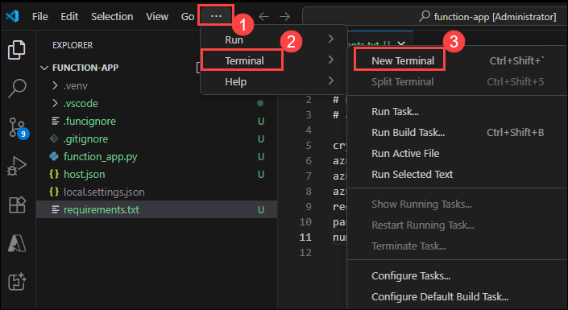

1. Run the command below and press **Enter** to install all the requirements.

    ```
   pip install -r requirements.txt
    ```

      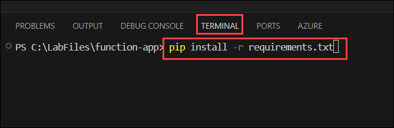

1. Open the **local.settings.json (1)** file and replace its contents with the **configuration (2)** provided below, and press `Ctrl+S` to save.

      ```json
         {
        "IsEncrypted": false,
        "Values": {
          "AzureWebJobsStorage": "<inject key="connectionString" enableCopy="false"/></inject>",
          "FUNCTIONS_WORKER_RUNTIME": "python",
          "AzureWebJobsFeatureFlags": "EnableWorkerIndexing",
          "storage<inject key="Deployment ID" enableCopy="false"/>_STORAGE": "<inject key="connectionString" enableCopy="false"/></inject>",
          "AzureWebJobsSecretStorageType": "Files"
        }
      }
      ```

   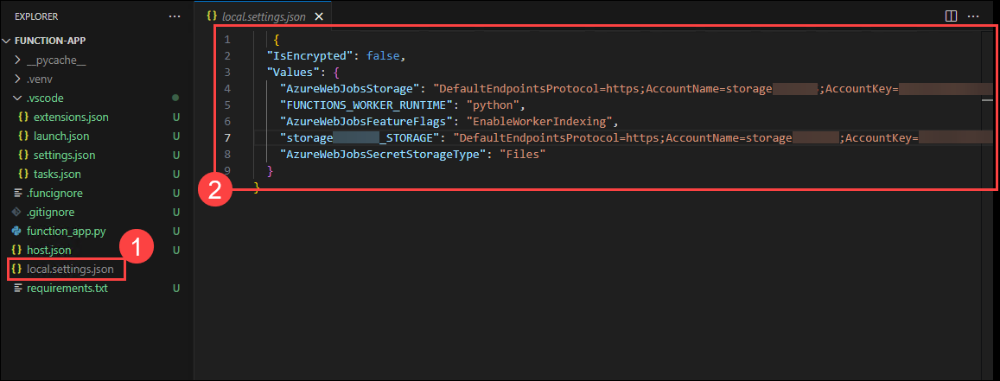

1. Open the **function-app.py (1)** file and add the following **import statements (2)** by replacing the existing ones:

      ```
      import logging
      from azure.storage.blob import BlobServiceClient
      import azure.functions as func
      import json
      import time
      from requests import get, post
      import os
      import requests
      from collections import OrderedDict
      import numpy as np
      import pandas as pd
      ```

      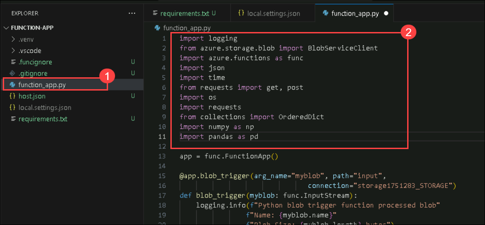
   
1. Replace the main function by copying and pasting the code provided below, then replace the **path (1)** and **connection (2)** placeholders with the specified values.

      ```
      app = func.FunctionApp()
   
      @app.blob_trigger(arg_name="myblob", path="<container-name>", connection="<storage-account-name>_STORAGE")
   
      def blob_trigger(myblob: func.InputStream):
          logging.info(f"Python blob trigger function processed blob"
                      f"Name: {myblob.name}" 
                      f"Blob Size: {myblob.length} bytes")
      ``` 
      - path = **input** 
      - connection = **storage<inject key="Deployment ID" enableCopy="false"/>_STORAGE**

         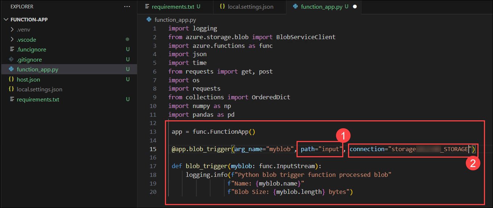

1. Add the following code block that calls the **Document Intelligence Analyze Layout API** on the uploaded document.

   - Replace **Your Document Intelligence Endpoint** : **<inject key="documentIntelligenceEndpoint"></inject>** **(1)**

   - Replace **Your Document Intelligence Key** : **<inject key="documentIntelligenceKey"></inject>** **(2)**.

   - Replace `<model-name>` with **model (3)**.

      ```
         # This is the call to the Document Intelligence endpoint
         endpoint = "Your Document Intelligence Endpoint"
         apim_key = "Your Document Intelligence Key"
         post_url = endpoint + "/formrecognizer/documentModels/<MODEL-NAME>:analyze?api-version=2023-07-31"
         source = myblob.read()
      
         headers = {
         # Request headers
         'Content-Type': 'application/pdf',
         'Ocp-Apim-Subscription-Key': apim_key,
            }
      ```

      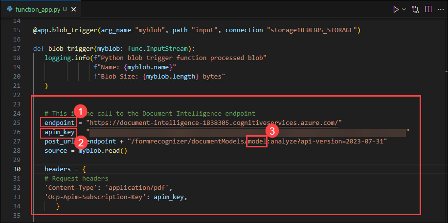
   
1. Next, add code to query the service and get the returned data.

      ```
         resp = requests.post(url=post_url, data=source, headers=headers)
      
         if resp.status_code != 202:
            print("POST analyze failed:\n%s" % resp.text)
            quit()
         print("POST analyze succeeded:\n%s" % resp.headers)
         get_url = resp.headers["operation-location"]
         
         wait_sec = 25
         time.sleep(wait_sec)
         # The layout API is async therefore the wait statement
         resp = requests.get(url=get_url, headers={"Ocp-Apim-Subscription-Key": apim_key})
         resp_json = json.loads(resp.text)
         status = resp_json["status"]
         
         if status == "succeeded":
            print("POST Layout Analysis succeeded:\n%s")
            results = resp_json
         else:
            print("GET Layout results failed:\n%s")
            quit()
         
         results = resp_json
      ```

      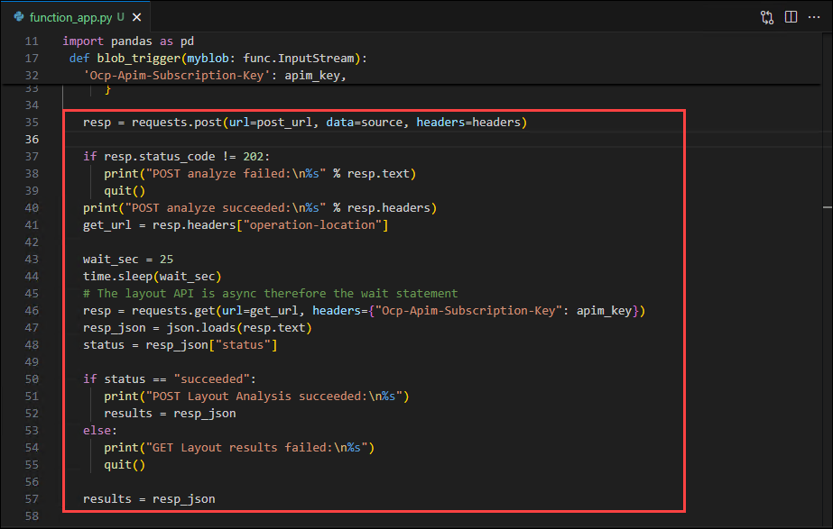

1. Add the following code to connect to the Azure Storage output container.
   
    - Replace **{storage-connection-string}** : **<inject key="connectionString" enableCopy="false"/></inject>**

      ```
         # This is the connection to the blob storage, with the Azure Python SDK
         blob_service_client = BlobServiceClient.from_connection_string("{storage-connection-string}")
         container_client=blob_service_client.get_container_client("output")
      
         # Assuming `results` is your JSON data
         data = json.dumps(results)

         # Create a new blob and upload the data
         blob_name = myblob.name + ".json"
         blob_client = container_client.get_blob_client(blob_name)
         blob_client.upload_blob(data, overwrite=True)
      ```

      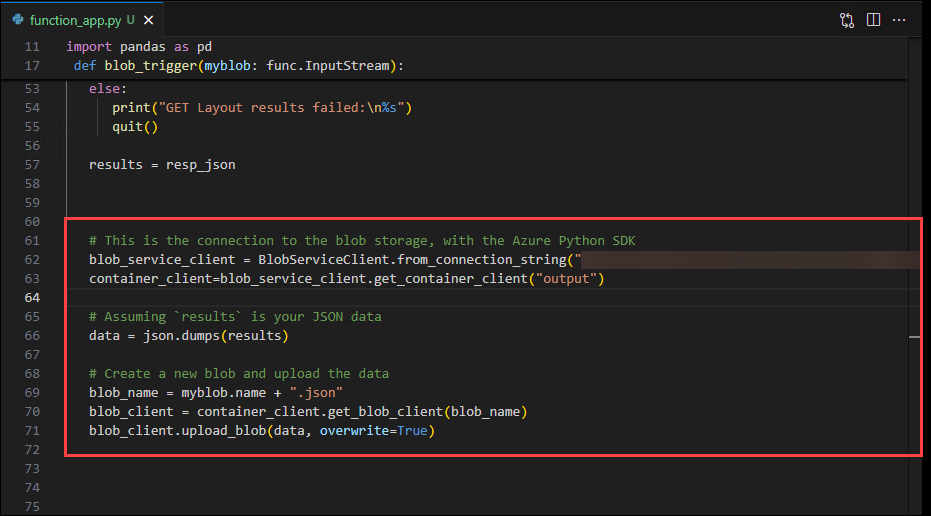

1. Please verify to ensure that the final code matches as below.

      ```
      import logging
      from azure.storage.blob import BlobServiceClient
      import azure.functions as func
      import json
      import time
      from requests import get, post
      import os
      import requests
      from collections import OrderedDict
      import numpy as np
      import pandas as pd
      
      app = func.FunctionApp()
      
      @app.blob_trigger(arg_name="myblob", path="<input container>", connection="storage<DID>_STORAGE") 
      
      def blob_trigger(myblob: func.InputStream):
         logging.info(f"Python blob trigger function processed blob"
                      f"Name: {myblob.name}"
                      f"Blob Size: {myblob.length} bytes"
         )
      
         # This is the call to the Document Intelligence endpoint
         endpoint = "<document-intelligence-endpoint>"
         apim_key = "<document-intelligence-key>"
         post_url = endpoint + "/formrecognizer/documentModels/<model-name>:analyze?api-version=2023-07-31"
         source = myblob.read()
         
         headers = {
            # Request headers
            'Content-Type': 'application/pdf',
            'Ocp-Apim-Subscription-Key': apim_key,
                  }
         
         resp = requests.post(url=post_url, data=source, headers=headers)
      
         if resp.status_code != 202:
            print("POST analyze failed:\n%s" % resp.text)
            quit()
         print("POST analyze succeeded:\n%s" % resp.headers)
         get_url = resp.headers["operation-location"]
         
         wait_sec = 25
         time.sleep(wait_sec)
         # The layout API is async therefore the wait statement
         resp = requests.get(url=get_url, headers={"Ocp-Apim-Subscription-Key": apim_key})
         resp_json = json.loads(resp.text)
         status = resp_json["status"]
         
         if status == "succeeded":
            print("POST Layout Analysis succeeded:\n%s")
            results = resp_json
         else:
            print("GET Layout results failed:\n%s")
            quit()
         
         results = resp_json
      
         # This is the connection to the blob storage, with the Azure Python SDK
         blob_service_client = BlobServiceClient.from_connection_string("{storage-connection-string}")
         container_client=blob_service_client.get_container_client("output")
      
         # Assuming `results` is your JSON data
         data = json.dumps(results)
      
         # Create a new blob and upload the data
         blob_name = myblob.name + ".json"
         blob_client = container_client.get_blob_client(blob_name)
         blob_client.upload_blob(data, overwrite=True)
      ```
      > **Note:** Please make sure the indentation of the code remains unchanged and proper to run the code successfully

1. Under **.vscode (1)** folder, open the **launch.json (2)** and replace the entire code with the code given below and press **Ctrl+S** to save:

      ```
      {
         "version": "0.2.0",
         "configurations": [
            {
                  "name": "Python Debugger: Current File",
                  "type": "debugpy",
                  "request": "launch",
                  "program": "${file}",
                  "console": "integratedTerminal"
            },
            {
                  "name": "Attach to Python Functions",
                  "type": "debugpy",
                  "request": "attach",
                  "connect": {
                     "host": "localhost",
                     "port": 9091
                  },
                  "preLaunchTask": "func: host start"
            }
         ]
      }
      ```

      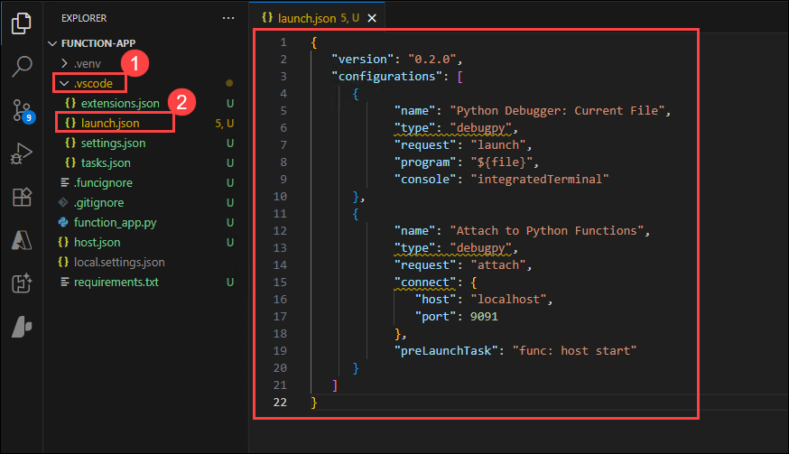

## Task 4: Run the Function App

In this task, you will run the function in VS Code, which uploads test invoices to the input container of the Azure Storage account to trigger the function. Afterwards, verify the output JSON files in the output container to confirm successful document analysis.

1. In Visual Studio Code, click the **ellipsis (...) icon (1)** in the top menu, expand **Terminal (2)**, and select **New Terminal (3)** from the dropdown.

   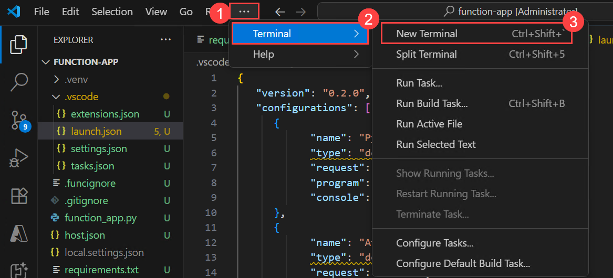

1. Press **Ctrl + F5** to execute the function.

   > **Note:** If a error appears, follow the steps below:

   - Click on **Debug Anyway**

      .png)

   - Then in the next pop-up, choose **Install debugpy Extension**. This will take you to the extension page.

      2.png)

   - Click **Install** to set up the **Python Debugger**. 

      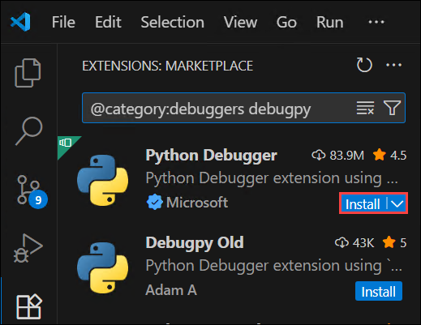

   - Press **Ctrl + F5** one more time to execute the function.

1. Once the function runs successfully, navigate back to the **Azure Portal** to trigger it by adding an input file.

   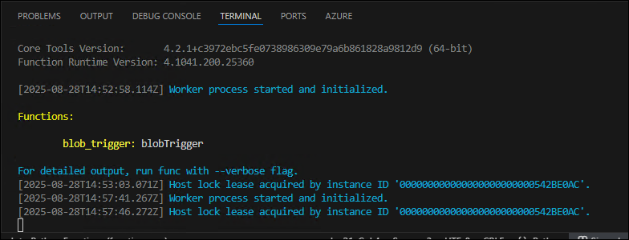

   > **Note:** If any pop-up occurs, close it.

      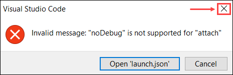

1. In the search bar, search and select **Storage Account (1)** under **Services (2)**.

   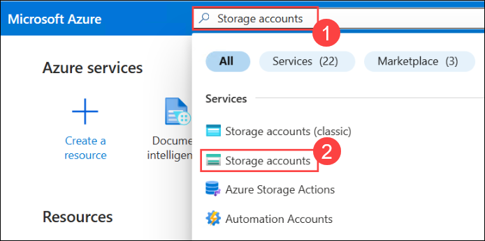

1. Select **storage<inject key="Deployment ID" enableCopy="false"/>** from the Storage accounts blade.

   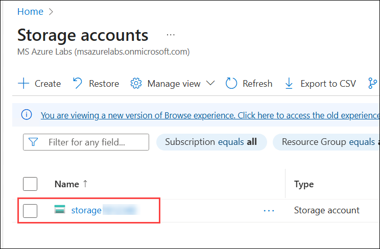

1. From the left navigation pane, expand **Data storage (1)**, select **Containers (2)**, then open the **input (3)** container.

   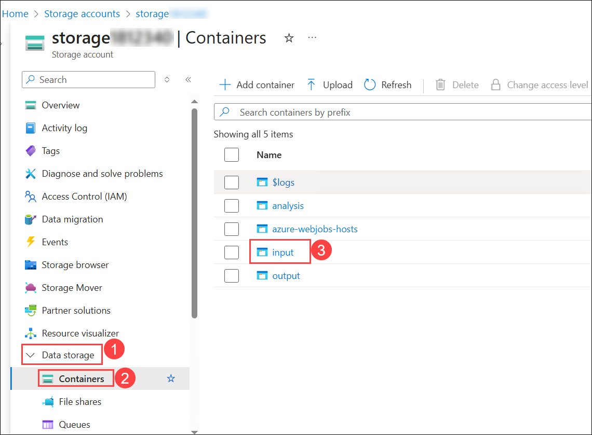
   
1. In the input container, click on **Upload (1)** button, in the **Upload blob** pop-up window click on **Browse for files (2)**.

   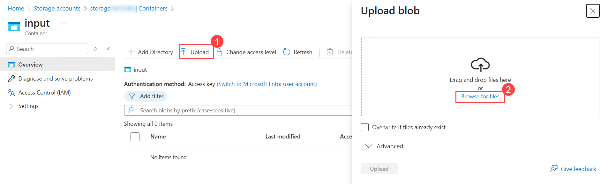

1. Navigate to `C:\LabFiles\Test` **(1)**, select **Invoice_6 and Invoice_7 (2)**, then click **Open (3)** to upload the files.

   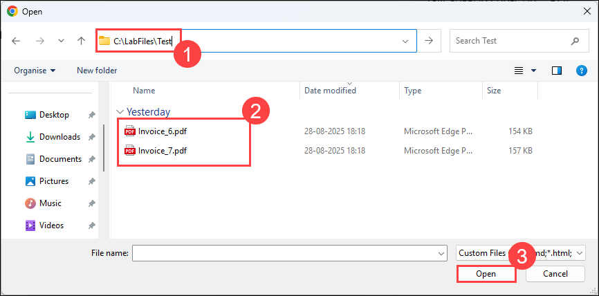
   
1. In the **Upload blob** pop-up window, click on **Upload** button.

   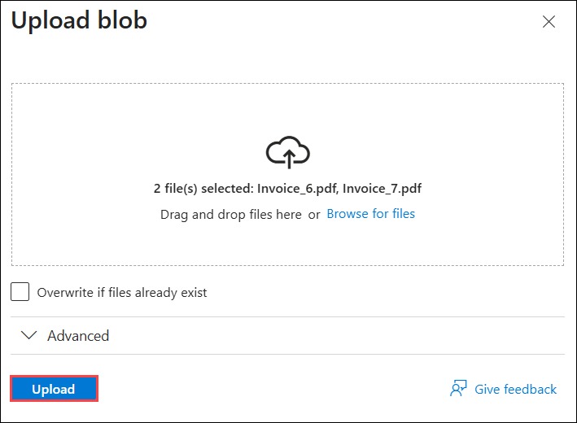

1. Navigate back to the **VS code** and verify the **logs** in the **Terminal**.

1. Once the function app is triggered successfully, return to the **storage account** in the Azure portal.

   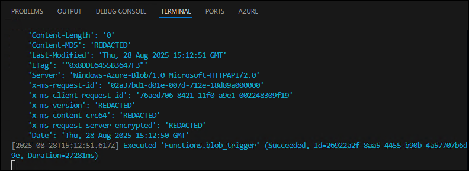

1. From the left navigation pane, expand **Data storage (1)**, select **Containers (2)**, then open the **output (3)** container

   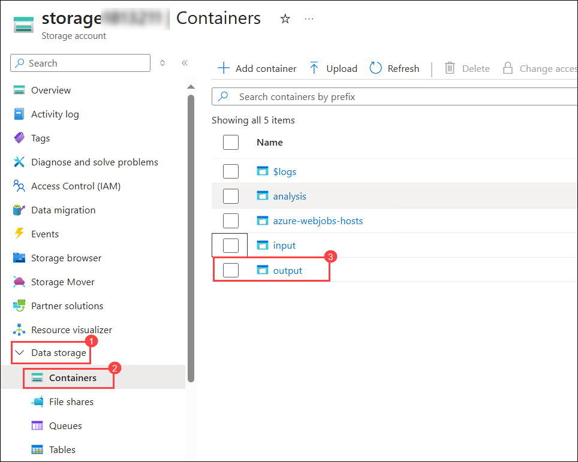

1. In the **output** container, click on the **input** folder and verify the **json** analysing the document has been generated successfully.

   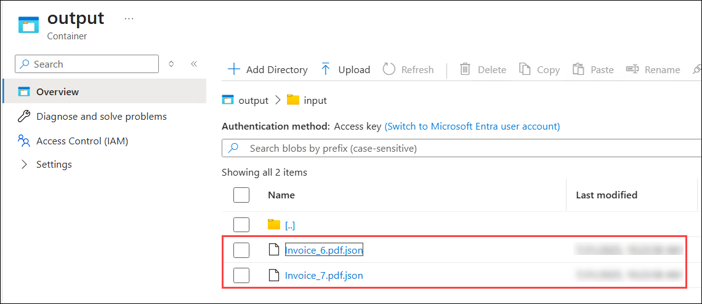

>**Congratulations** on completing the Task! Now, it's time to validate it. Here are the steps:
> - Hit the Validate button for the corresponding task. If you receive a success message, you have successfully validated the lab. 
> - If not, carefully read the error message and retry the step, following the instructions in the lab guide.
> - If you need any assistance, please contact us at cloudlabs-support@spektrasystems.com.

<validation step="44d3193c-9401-4326-a2f5-067cf63f0c54" />

## Task 5: Working with AI Search

In this task, you will connect Azure AI Search to Blob Storage to index analyzed document data. You will configure the search index and indexer to make key fields like Organization and Address searchable and facetable, then verify the indexed data by running search queries.

1. In the Azure portal, enter **AI Search (1)** in the top search bar and select **AI Search (2)** from the Services list.

      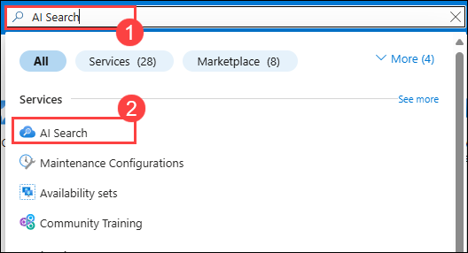
   
1. In **AI foundry | AI Search** tab, select **search-<inject key="Deployment ID" enableCopy="false"/>**.

      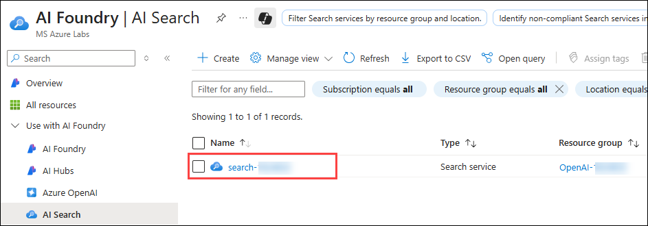
   
1. In the Overview page of **search-<inject key="Deployment ID" enableCopy="false"/>**, click on **Import data** from the top menu bar.

      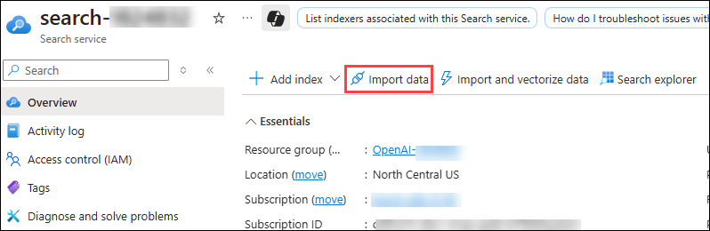

1. Provide the following values:

      - Data Source: **Azure Blob Storage (1)**.
      - Data Source Name: **data-source-<inject key="Deployment ID" enableCopy="false"/> (2)**.
      - Parsing Mode: **JSON (3)**.
      - Subscription: Select the **Default subscription (4)**.
      - Connection string: Click on **Choose an existing connection (5)**.

        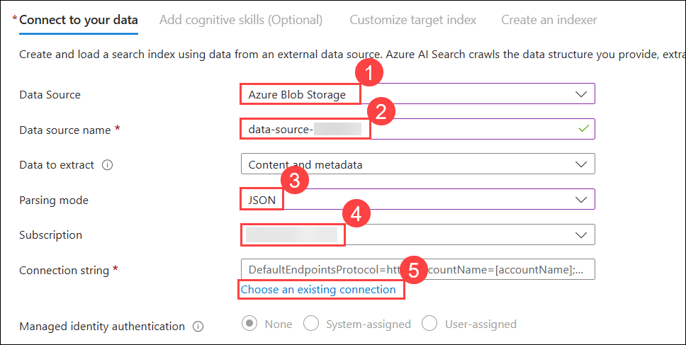

      - From the left pane, select **storage<inject key="Deployment ID" enableCopy="false"/> (6)**, then select **output (7)** container, and click **Select (8)** at the bottom.

        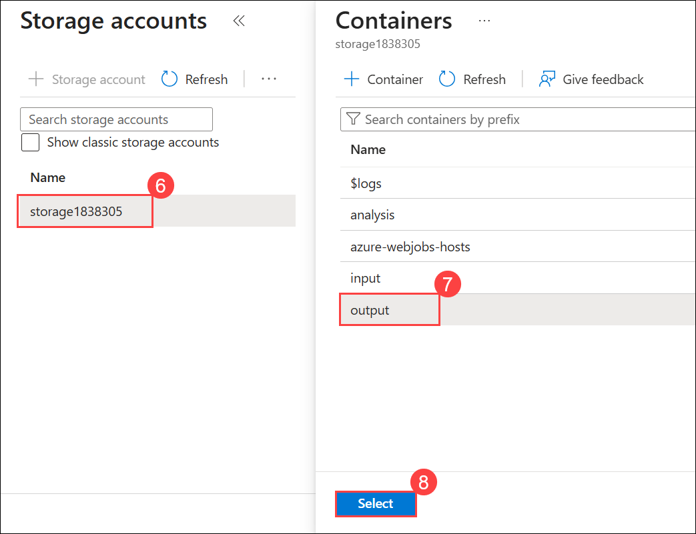

      - Container Name: **output (9)**
      - Blob Folder: **input (10)**
      - Click on **Next: Add cognitive skills (Optional) (11)**
     
        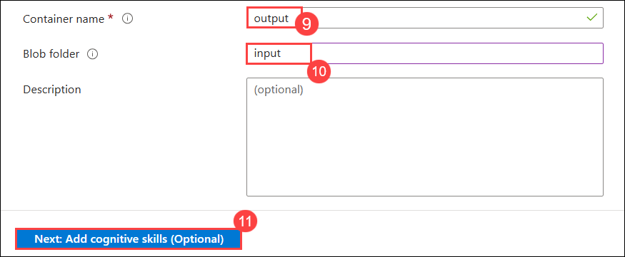

1. On the **Add cognitive skills (Optional)** page, click **Skip to: Customize target index** at the bottom.

      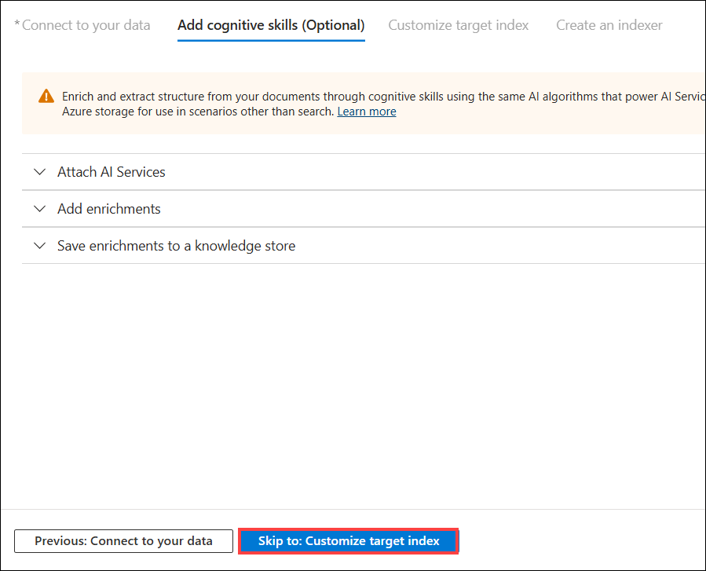

1. On the **Customize target index** page, set the Index name to **azureblob-index (1)**, and ensure all fields are marked as **Retrievable (2)** and **Searchable (3)**.

      

1. On the **Import data** page, expand **analyzeResult (1)** > **documents (2)** > **fields (3)**, then expand **Organization (4)** and check the Facetable boxes for **type, valueString, and content (5)**; do the same for **Address (6)** fields **type, valueString, and content (7)**, then click **Next: Create an indexer (8)**.

      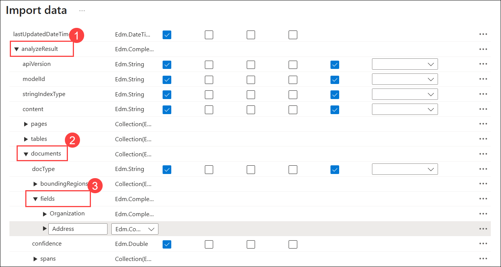

      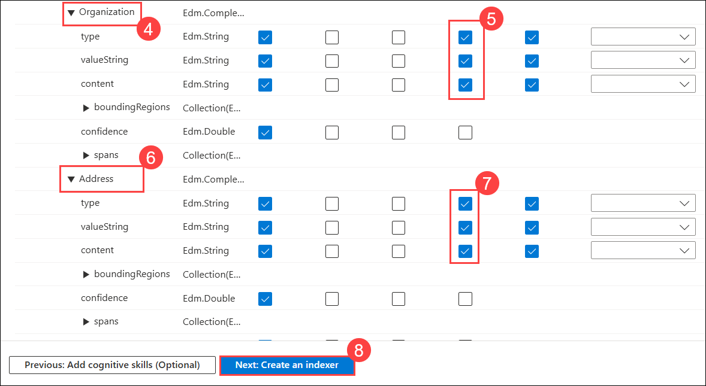
      
1. On the **Create an indexer** page, enter the name as **azureblob-indexer** **(1)** and click on **Submit** **(2)** at the bottom.
   
      

1. From the left navigation pane, expand **Search management (1)**, select **Indexes (2)**, then click **azureblob-index (3)**.

      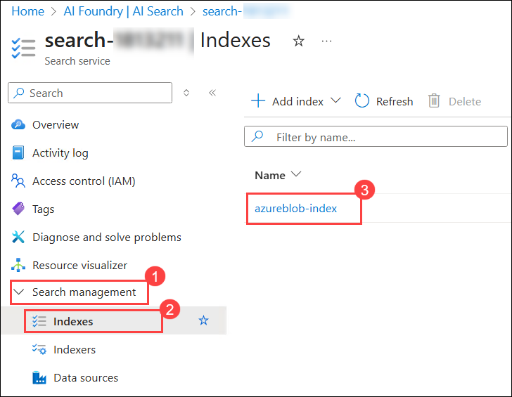

1. In the **azureblob-index**, click on the **Search** button next to the search bar.

      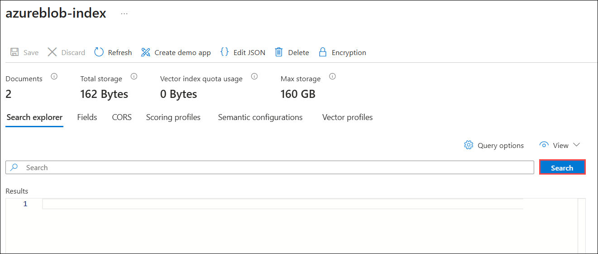

1. Verify the document that has been analysed.

      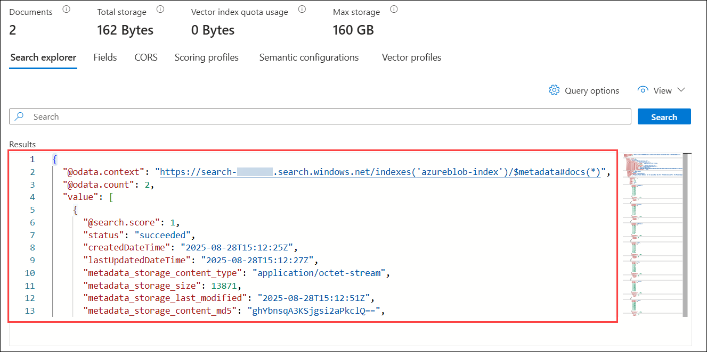

1. Search for `fields` in the document and verify that the **Organization** and **Address** fields, created during training, have been correctly analyzed.

      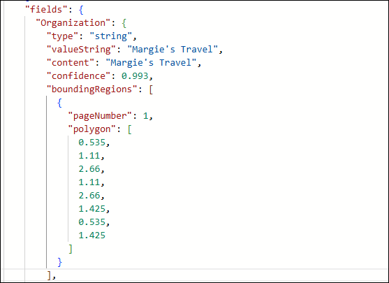

      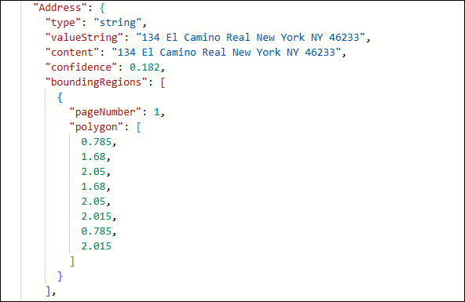

## Summary

In this lab, you have completed the following:

- Created a Document Intelligence resource.
- Trained and labeled data for document analysis.
- Developed and deployed an Azure Function App.
- Executed the Function App to process documents.
- Integrated and explored AI-powered search capabilities.

### You have successfully completed the lab. Now, click on **Next >>** from the lower right corner to proceed on to the next lab.


