# Lab 02: Utilize your Data Set using OpenAI

## Estimated Duration: 1 Hour

In this lab, you will learn how to leverage Azure OpenAI to interact with custom data using the ChatGPT model. By uploading your own data into the Azure AI Foundry portal, you will enable specific, tailored responses to user queries based on the uploaded content. The lab covers steps to upload files, configure the system to manage queries effectively, and deploy the ChatGPT model as a web app. Additionally, the interactions are captured and stored in Cosmos DB, ensuring traceability and persistence of conversation history. This lab provides hands-on experience with customizing AI responses and deploying AI models in a real-world application.
  
## Architecture Diagram

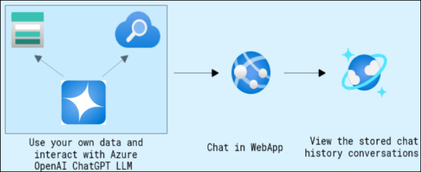

## Lab Objectives
In this lab, you will perform,

- Task 01: Navigate to Azure OpenAI Playground
- Task 02: Upload your own data
- Task 03: Interact with Azure OpenAI ChatGPT LLM using your own data

## Task 1: Navigate to Azure OpenAI Playground

1. In the Azure portal, search for **openai** and select **Azure OpenAI**.

   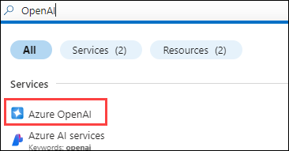

2. In the **AI Foundry | Azure OpenAI** tab, select **OpenAI-<inject key="Deployment ID" enableCopy="false"/>**.

   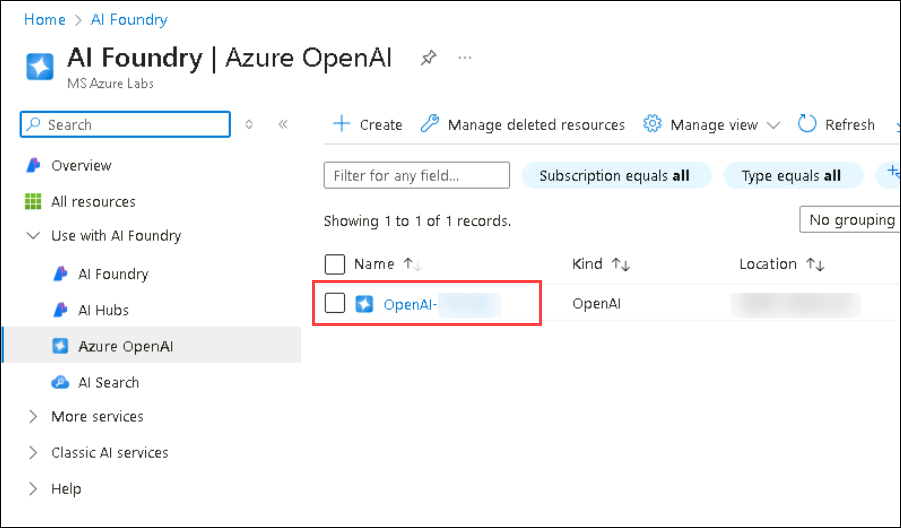

3. On the **Azure OpenAI** page, click on **Go to Azure AI Foundry portal**.

   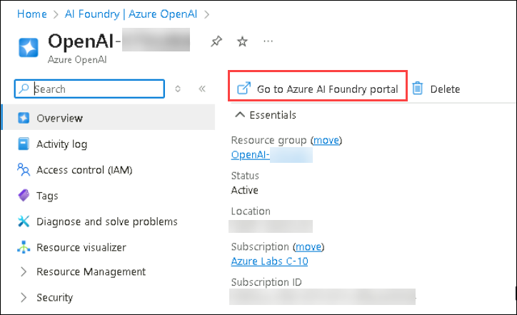

   > **Note:** If you don’t see an option like the one shown in the image above, refer to the image below to navigate to Azure AI Foundry.

      

## Task 2: Upload your own data

In this step, we will be using Porche's owner manual for Taycan, Panamera, and Cayenne models.

1. In the Playground section, click on **Chat**. Then, under the **Setup** tab in the **Chat** playground, click **+ Add a data source (2)** within the **Add your data (1)** section. 

   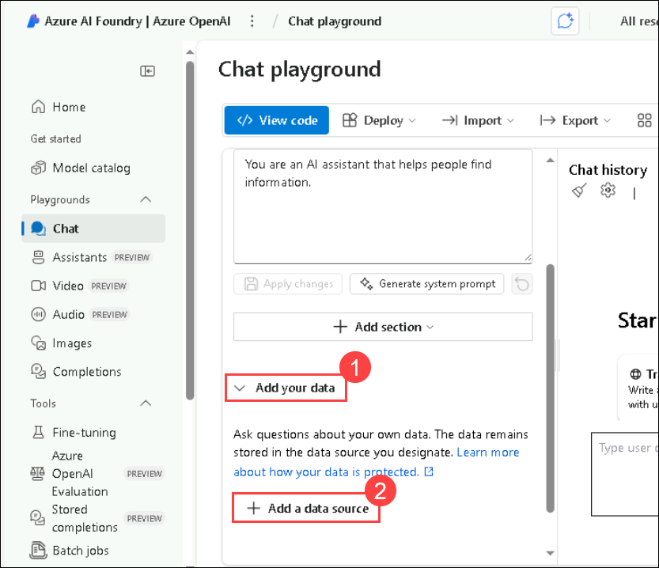
   
1. Fill the following details in **Select or add data source** and click on **Next** **(6)**.
    
    - Select data source: **Upload files (preview)** **(1)**

    - Subscription: Select your **subscription** from the drop-down section **(2)**

    - Select Azure Blob storage resource: Choose the already created storage account **storage<inject key="Deployment ID">** **(3)**. 
      
         > **Note**: **Turn on CORS** when prompted.

         

      > **Note**: If you encounter any issues while enabling CORS, please follow the steps below :

         - Navigate to the Azure portal.
         - Search for storage account in the search bar and select **storage<inject key="Deployment ID" enableCopy="false"/>**.
         - In the left pane, search for **CORS (1)** and select **Resource sharing (CORS) (2)**.

            
          
         - In the first row, ensure only **GET**, **POST**, **OPTIONS**, **PUT** **(1)** is enabled under allowed methods, provide it as **content-length** **(2)** under exposed headers and set the Max age to **120** **(3)**.
         - In the second row, set the Allowed origins to * **(4)**, enable **GET**, **POST**, **OPTIONS**, **PUT** **(5)** under allowed methods, set the Allowed headers and Exposed headers to * **(6)** and * **(7)** respectively and the Max age to **200 (8)**.
         - Click on **Save**.
          
           

         - Navigate back to the Azure AI Foundry portal, close the window and re-perform steps 1 and 2.
            
    - Select Azure Cognitive Search resource: Select the search service **search-<inject key="Deployment ID">** **(4)**.

    - Enter the index name: Give an index name as **aoaiworkshop** **(5)**
      
    - Click on **Next**
      
1. On the **Upload files** tab, click **Browse for a file**. Navigate to the path `C:\LabFiles\Data\Lab 2` and press Enter. Select all the PDF files in this folder, then click **Open** to upload them. 

   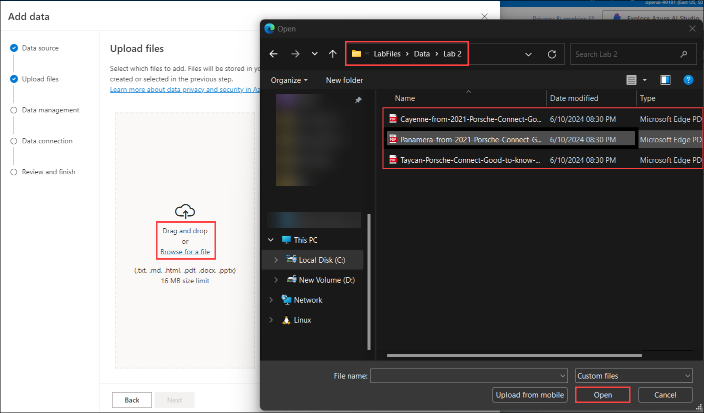

1. Click on **Upload files** **(1)**, and click on **Next** **(2)**.

   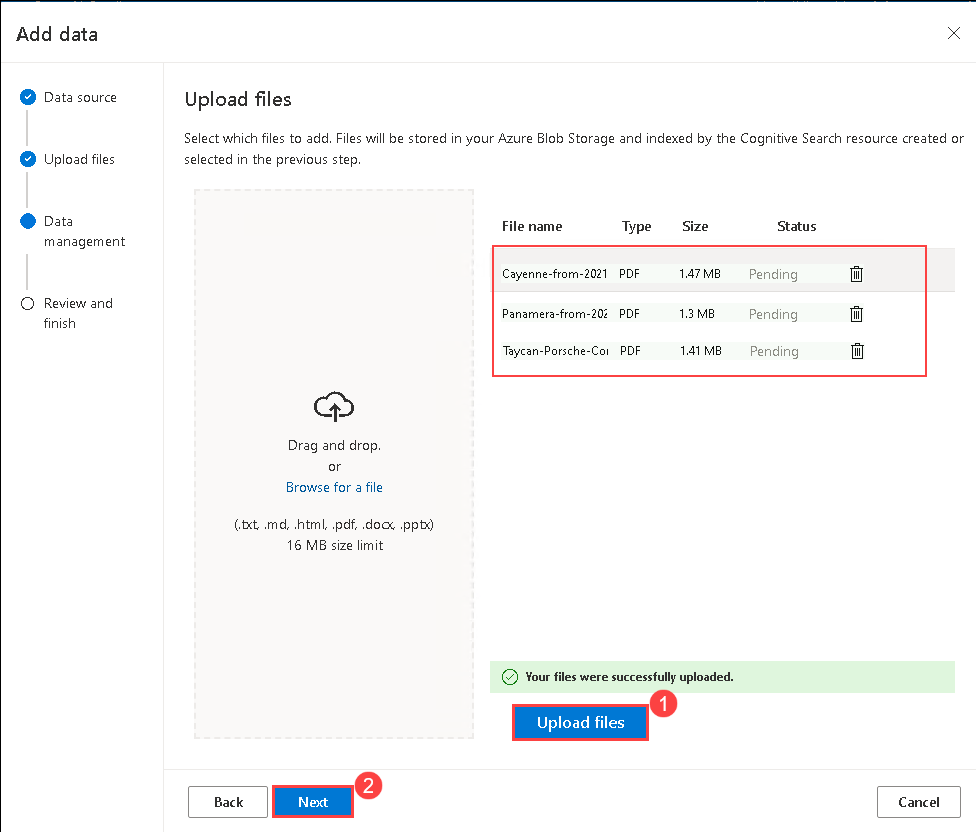

1. On the **Data Management** page, from the drop-down select **keyword (1)** as Search type and click on **Next (2)**.

   

1. On the **Data Connection page**, select **API Key** and click on Next.

   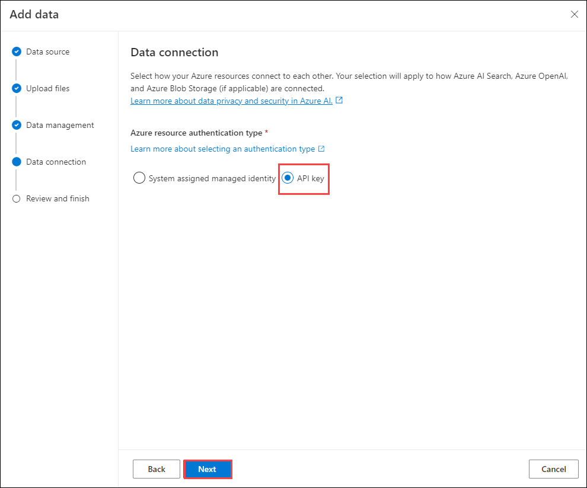

1. On the **Review and finish** page, click on **Save and close**.

   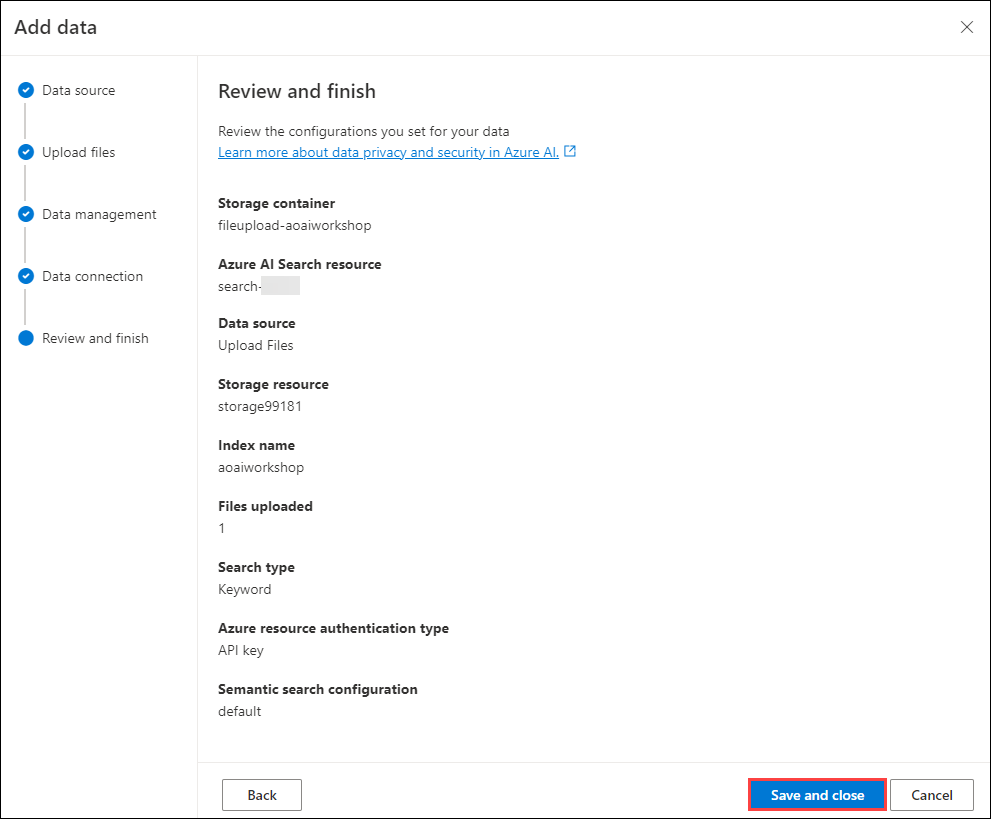

## Task 3: Interact with Azure OpenAI ChatGPT LLM using your own data

1. Under the **Add your data** pane, wait until your data upload is finished.

   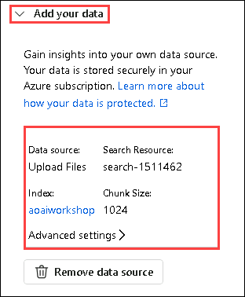

1. Under the **Chat Session** pane, you can start testing out your prompts by entering the query like this.

    ```
    How to operate Android Auto in Porche Taycan? give step-by-step instructions
    ```

      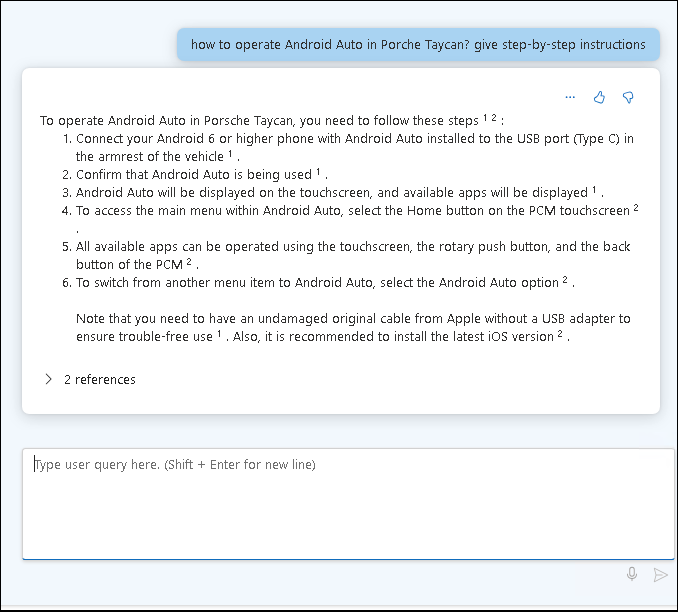

1. You can customize the responses of your bot by  updating the message `Your name is Alice. You are an AI assistant that helps people find information about Porche cars. Your responses should not contain any harmful information` **(1)** under **Give the model instructions and context**  and click on **Apply changes** **(2)**.

   

1. On **Update system message?** pop-up, click on **Continue**.

   

1. Under the **Chat Session** pane, you can start testing out your prompts by entering the query like this.

    ```
    What is your name
    ```
   
   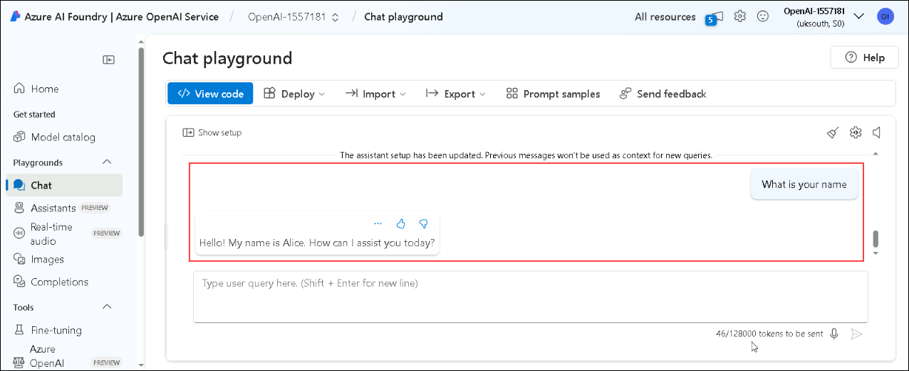

1. In the **Setup** pane, click on **Parameters**. You can try and experiment with different parameter configurations to see how they change the behavior of the model.

    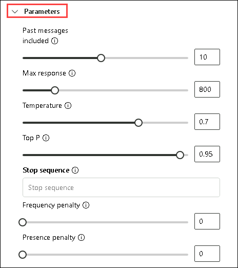

1. On the **Chat**, Click on **Deploy to (1)** on the top right and click on **...as a webapp (2)**.

   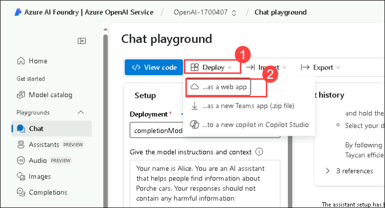

1. Add the following details and click on **Deploy**:

   - Name: **webapp-<inject key="Deployment ID" enableCopy="false"/> (1)**
   - Subscription: **Select the default subscription (2)**
   - Resource Group: Select **OpenAI-<inject key="Deployment ID" enableCopy="false"/>** **(3)**
   - Location: **Select Sweden Central (4)**
   - Pricing Plan: **Choose Standard (S1) (5)**
   - **Enable** chat history in the web app **(6)**
   - Click **Deploy (7)**

     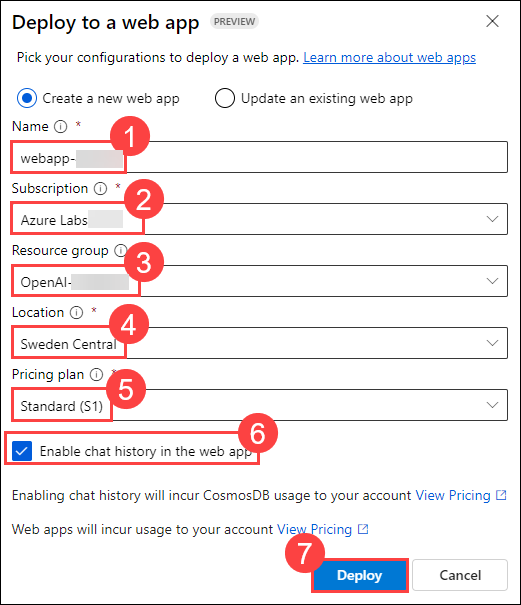

     > **Note:** Wait for 10 minutes for the webapp to be deployed successfully.

1. In the Azure Portal, search for **App Services** in the search bar and select it from the search results. 

      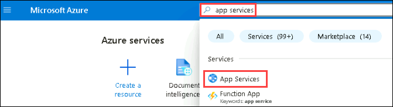

1. Select the **webapp-<inject key="Deployment ID" enableCopy="false"/> (1)** App Service.

      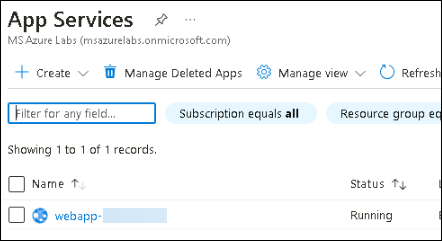
      
1. Click on **Browse** and the web app is up and running.

    
    
    

      > **Note:** If you see a blank screen, wait for some time and refresh the page.

      > **Note:** In cases of permissions asked, click on **Accept**.

      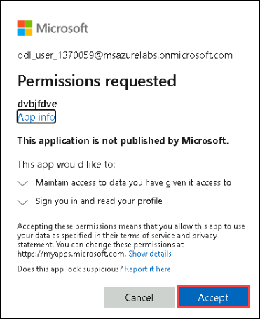

      > **Note:** In case of an internal server error, navigate back to the Azure AI Foundry portal and follow the steps below:

   - In the **Chat (1)** section under Playgrounds, click **Deploy to (2)** in the top-right corner, then select **...as a webapp (3)**.

       

   - Click on **Update an existing web app (1)**, select the **default subscription (2)**, then choose **webapp-<inject key="Deployment ID" enableCopy="false"/> (3)**. Check the box for **Enable chat copilot in web app (4)**, and finally, click **Deploy (5)**.
     
      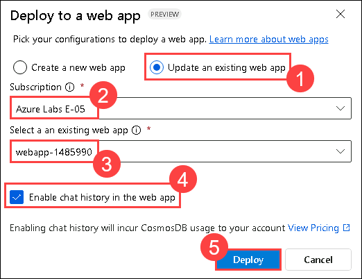
     
   - Navigate to **App Services**, select **webapp-<inject key="Deployment ID" enableCopy="false"/>**, click on **Deployment (1)**, then select **Deployment Center (2)**. Go to the **Logs** tab and verify that the status is **Success (3)**.

      
     
   - Click on **Browse** from the overview tab again.

     >**Note:** If the internal server issue continues, restart the web app and then try accessing it. Please note that it may take some time to become available.
     
1. Chat with the bot and check its working state. Provide questions related to the document we had previously uploaded.

1. In the Azure Portal, search for **Azure Cosmos DB** and select it from the search results.

    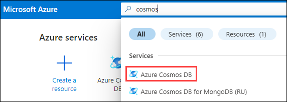

1. Verify **db-webapp-<inject key="Deployment ID" enableCopy="false"/>** has been created then select it.
   
   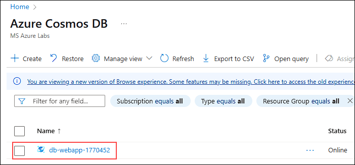

1. Go to **Data Explorer (1)** in your Azure Cosmos DB account, then expand the **db_conversation_history** database and the **conversations** container **(2)**. Verify that the conversation data has been successfully captured from the web app, as shown in the image below.

    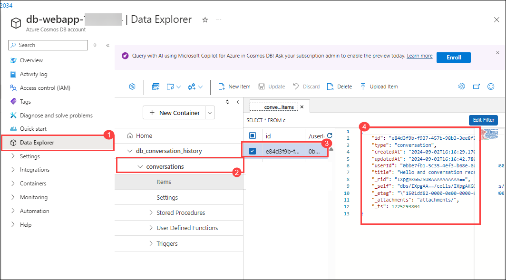

<validation step="ba1751b9-d16b-47ac-9282-a6ecc8cb4870" />
 
>**Congratulations** on completing the Task! Now, it's time to validate it. Here are the steps:
> - Hit the Validate button for the corresponding task. If you receive a success message, you have successfully validated the lab. 
> - If not, carefully read the error message and retry the step, following the instructions in the lab guide.
> - If you need any assistance, please contact us at cloudlabs-support@spektrasystems.com.
   
## Summary

In this lab, you learned how to use Azure AI Foundry to upload your own data and interact with the ChatGPT model using that data. You configured the system to handle specific queries and deployed the model as a web app. Finally, you verified that interactions were captured in Cosmos DB, completing the lab successfully.

## You have successfully completed the lab
