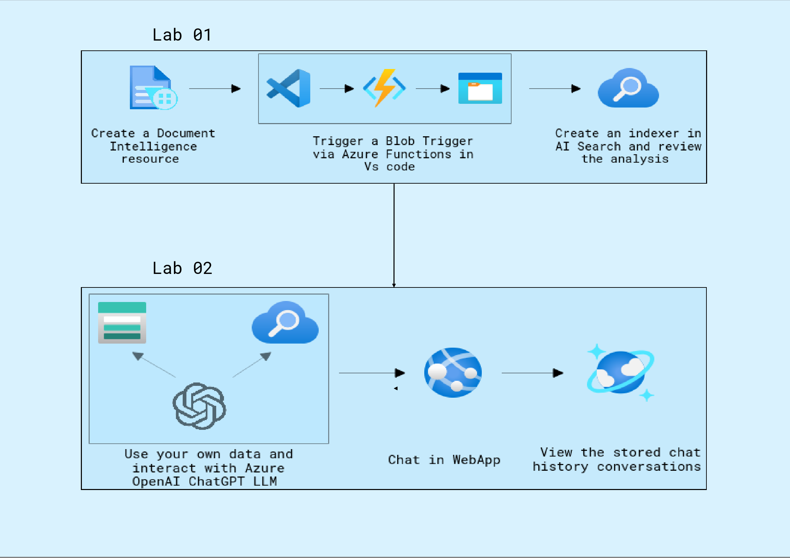

# **Getting Started with Your Automate-document-processing-using-AzureOpenAI Workshop**
 
Welcome to your Automate-document-processing-using-AzureOpenAI Workshop! We've prepared a seamless environment for you to explore and learn about Azure services. Let's begin by making the most of this experience:

## Overview

In this lab, participants will explore document processing using Azure services to streamline and enhance the management of various document types. The focus will be on leveraging Azure's capabilities for analyzing and extracting data from documents, whether in electronic or printed formats. The lab will cover the end-to-end process, including data extraction, sentiment analysis, language detection, OCR, and document classification. Participants will utilize Azure tools such as the Document Intelligence resource, Azure Functions for blob triggers, and AI Search for document analysis. Additionally, they will integrate their processed data with Azure OpenAI's ChatGPT LLM via a web application and Cosmos DB to assess and interact with the information effectively.

## Objectives

1. **Document Processing with Azure Services:**
- Utilize Azure services for text extraction, data extraction, sentiment analysis, language detection, OCR, and document classification.
- Train datasets using Azure's Document Intelligence resource to analyze and manage various document types.

2. **Trigger-Based Document Analysis:**
- Set up and configure a Function App with a blob trigger to automatically process documents stored in Azure Storage.
- Analyze the documents produced by the storage account using Azure AI Search for efficient data retrieval and insights.

3. **Integration and Interaction:**
- Upload and process your own data using the trained Document Intelligence model.
- Interact with Azure OpenAI's ChatGPT LLM through a web application to assess and utilize the processed document data.
- Evaluate the integration of processed data with Cosmos DB to enhance data management and application functionality.

## Prerequisites

Participants should have: Basic knowledge and understanding of the following

- Familiarity with AI concepts.
- Experience with Azure cloud services, including how to navigate the Azure portal.
- Basic knowledge of programming languages commonly used with AI models, such as Python.
  
## Architecture Diagram

**Azure Document Intelligence** processes and extracts data from documents. **Azure Functions** trigger the document processing based on blob changes. **Azure Storage Account** stores the documents to be processed. **Azure AI Search** indexes and searches the extracted data. **Azure OpenAI Service** provides AI capabilities for natural language processing and generation. **Web Application** facilitates user interaction and displays the results of the AI processing. A storage mechanism stores chat history for viewing and analysis.

## Explanation of Components

- **Azure Document Intelligence:** Document Intelligence in Azure is a service that uses AI to extract structured data from unstructured documents.
- **Azure Functions:** is a serverless compute service that allows you to run code without having to provision or manage infrastructure. You can write code in various languages and trigger it based on events like HTTP requests, timers, or messages from queues or topics
- **Azure AI Search:** is a cloud-based search service that allows you to add search capabilities to your applications. It provides features like autocomplete, faceted search, and spell correction, making it easy for users to find relevant information.
- **Azure Function app:** is a collection of Azure Functions that are grouped together and share the same configuration settings. It provides a way to manage and deploy multiple functions as a single unit.
- **Azure OpenAI:** is a service that provides access to OpenAI's powerful language models, such as GPT-3 and GPT-4, through Azure's cloud platform. This allows developers to build applications that can generate human-quality text, translate languages, write different kinds of creative content, and answer your questions in an informative way.
- **Azure Web App:** is a fully managed platform for building, deploying, and scaling web applications. It supports various programming languages and frameworks,and offers features like continuous deployment, scaling, and integration with other Azure services.

# **Getting Started with Your Automate-document-processing-using-AzureOpenAI Workshop**
 
Welcome to your Automate-document-processing-using-AzureOpenAI Workshop! We've prepared a seamless environment for you to explore and learn about Azure services. Let's begin by making the most of this experience:
 
## **Accessing Your Lab Environment**
 
Once you're ready to dive in, your virtual machine and lab guide will be right at your fingertips within your web browser.

  

### **Virtual Machine & Lab Guide**
 
Your virtual machine is your workhorse throughout the workshop. The lab guide is your roadmap to success.
 
## **Exploring Your Lab Resources**
 
To get a better understanding of your lab resources and credentials, navigate to the **Environment** tab.
 
  
 
## **Utilizing the Split Window Feature**
 
For convenience, you can open the lab guide in a separate window by selecting the **Split Window** button from the Top right corner.
 
  

## **Managing Your Virtual Machine**
 
Feel free to start, stop, or restart your virtual machine as needed from the **Resources** tab. Your experience is in your hands!

  

## **Lab Duration Extension**

1. To extend the duration of the lab, kindly click the **Hourglass** icon in the top right corner of the lab environment. 

   

    >**Note:** You will get the **Hourglass** icon when 10 minutes are remaining in the lab.

2. Click **OK** to extend your lab duration.
 
   

3. If you have not extended the duration prior to when the lab is about to end, a pop-up will appear, giving you the option to extend. Click **OK** to proceed.

## **Let's Get Started with Azure Portal**
 
1. On your virtual machine, click on the **Azure Portal** icon as shown below:
 
    .png)

1. On the **Sign in to Microsoft Azure** tab you will see the login screen, in that enter the following email/username, and click on **Next**. 

   * **Email/Username**: <inject key="AzureAdUserEmail"></inject>
   
      
     
1. Now enter the following password and click on **Sign in**.
   
   * **Password**: <inject key="AzureAdUserPassword"></inject>
   
      
     
1. If prompted to stay signed in, you can click "No."
 
1. If a **Welcome to Microsoft Azure** pop-up window appears, simply click "Maybe Later" to skip the tour.
 
1. Click "Next" from the bottom right corner to embark on your Lab journey!
 
     .png)
 
Now you're all set to explore the powerful world of technology. Feel free to reach out if you have any questions along the way. Enjoy your workshop!
