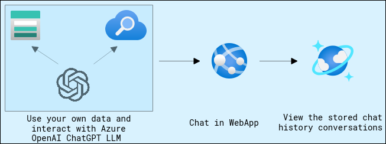
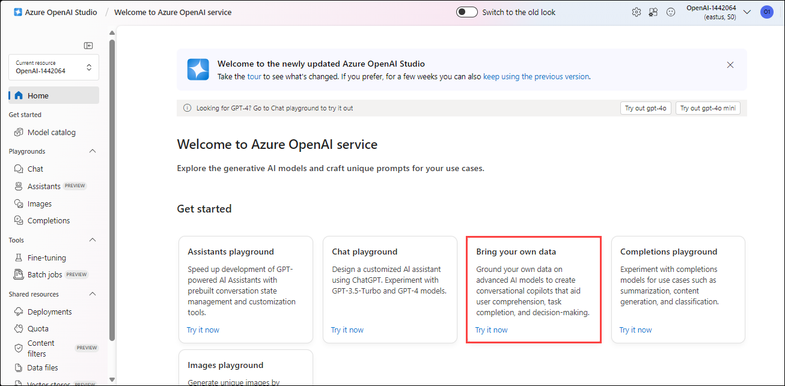
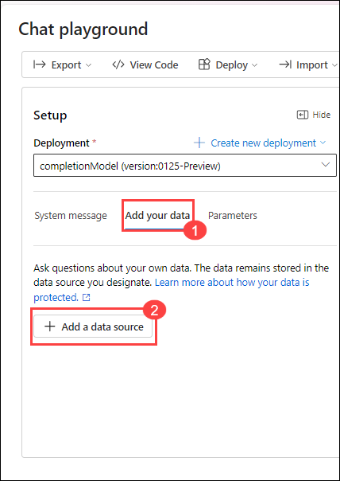
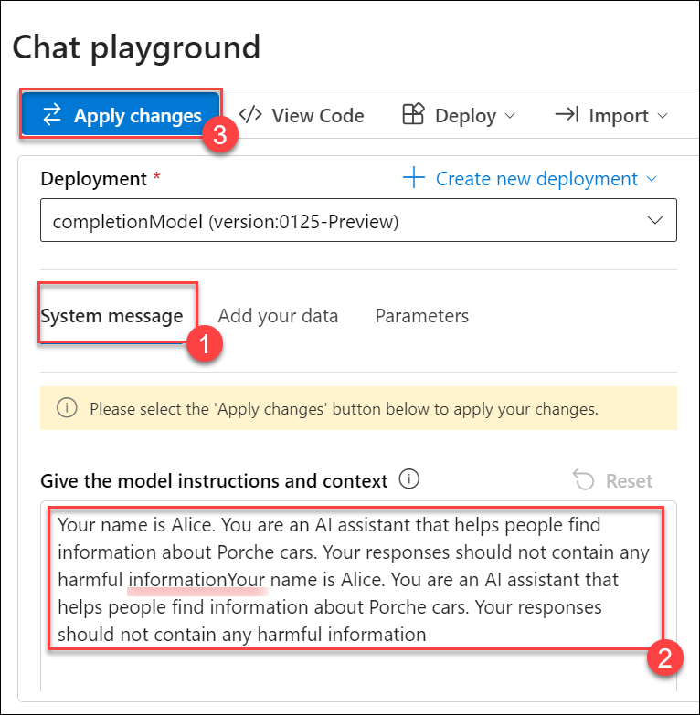
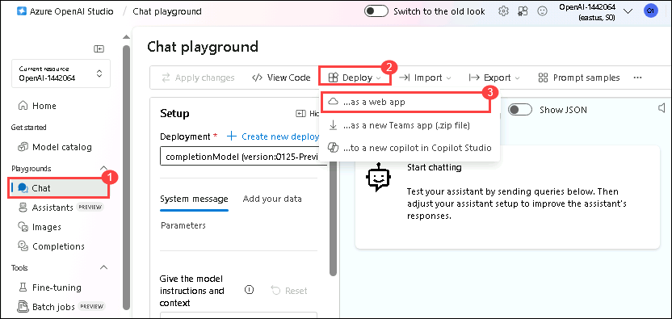
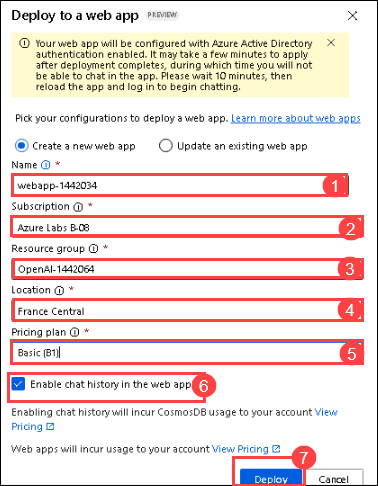
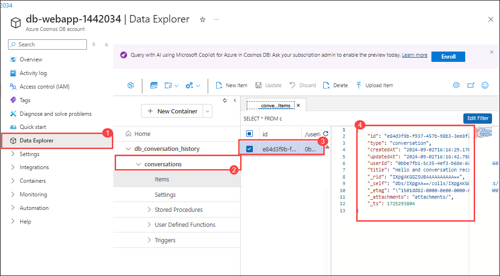

# Utilize your Data Set using OpenAI

## Lab Objectives

- Use your own data
- Interact with Azure OpenAI ChatGPT LLM
- Assess by employing a web application alongside Cosmos DB
  
## Architecture Diagram



### Task 1: Navigate to Azure OpenAI Playground

1. In `portal.azure.com`, search for **openai** and select **Azure OpenAI**.

   

2. In the Azure AI Services | Azure OpenAI tab, select **OpenAI-<inject key="Deployment ID" enableCopy="false"/>**.

      

3. On the **Azure OpenAI** page, click on **Go to Azure OpenAI Studio**.

      

4. In the prompt select **Explore the new experience**.

     

6. On the **Azure OpenAI Studio**, scroll down and click on **Bring your own data**.

   

### Task 2: Upload your own data

In this step, we will be using Porche's owner manual for Taycan, Panamera, and Cayenne models.

1. Click on **Add a data source** under **Add your data** of the **Setup** tab.

   
   
1. Fill the following details in **Select or add data source** and click on **Next** **(6)**.
    
    - Select data source: **Upload files (preview)** **(1)**

    - Subscription: Select your subscription from the drop-down section **(2)**

    - Select Azure Blob storage resource: Choose the already created storage account **storage<inject key="Deployment ID">** **(3)**. 
      
      - **Note**: **Turn on CORS** when prompted.

         

    - Select Azure Cognitive Search resource: Select the search service **search-<inject key="Deployment ID">** **(4)**.

    - Enter the index name: Give an index name as **aoaiworkshop** **(5)**.
    - Click on Next
      

1. On the **Upload files**, click on **Browse for a file** **(1)** enter the following `C:\LabFiles\Data\Lab 2` **(2)** path and hit enter, select the **Panamera-from-2021-Porsche-Connect-Good-to-know-Owner-s-Manual** **(3)** pdf  file and click on **Open** **(4)** files.

   

1. Click on **Upload files** **(1)**, and click on **Next** **(2)**.

   

1. On the **Data Management** page, from the drop-down select **keyword (1)** as Search type and click on **Next (2)**.

   

1. On the **Data Connection page**, select **API Key** and click on Next.

   

1. On the **Review and finish** page, click on **Save and close**.

   

### Task 3: Interact with Azure OpenAI ChatGPT LLM using your own data

1. Under the **Add you data** pane , wait until your data upload is finished.

   

1. Under the **Chat Session** pane, you can start testing out your prompts by entering the query like this.

    ```
    how to operate Android Auto in Porche Taycan? give step-by-step instructions
    ```

      

1. You can customize the responses of your bot by selecting the **system message**. Click on **System message** **(1)** to update the value under the system message with `Your name is Alice. You are an AI assistant that helps people find information about Porche cars. Your responses should not contain any harmful information` **(2)** and click on **Apply changes** **(3)**. Here we have edited the default system message.

   

1. On **Update system message?** pop-up, click on **Continue**.

   

1. Under the **Chat Session** pane, you can start testing out your prompts by entering the query like this.

    ```
    What is your name
    ```
   
   

1. In the **Configuration** pane, click on **Parameters**. You can try and experiment with different parameter configurations to see how they change the behavior of the model.

    

1. On the **Chat (1)** , Click on **Deploy to (2)** on the top right and click on **as a webapp (3)**.

   

1. Add the following details and click on **Deploy**:

   - Name: **webapp-<inject key="Deployment ID" enableCopy="false"/> (1)**
   - Subscription: **Select the default subscription (2)**
   - Resource Group: Select **OpenAI-<inject key="Deployment ID" enableCopy="false"/>** **(3)**
   - Location: **Select Central US (4)**
   - Pricing Plan: **Choose Basic (B1) (5)**
   - **Enable** chat history in the web app **(6)**
   - Click **Deploy (7)**

     

       >**Note:** In cases of an error `No instances were able to satisfy the request`, please change the name of the resource and try deploying in any other region.
    
1. Navigate to App Services and verify **webapp-<inject key="Deployment ID" enableCopy="false"/> (1)** has been created.

      

      
   
      > **Note:** In cases of permissions asked, click on **Accept**.

      
      
1. Click on **Browse** and the web app is up and running.

    

1. Chat with the bot and check its working state. Provide questions related to the document we had previously uploaded.

1. Search for cosmos DB in the portal and select the resource.

    

1. Verify **db-webapp-<inject key="Deployment ID" enableCopy="false"/>** has been created.

1. Go to Data Explorer, expand **db_conversation_history** database **(1)** > **conversations** container **(2)** and verify that the conversations has been captured by cosmos db from webapp as shown in the below image.

    

<validation step="ba1751b9-d16b-47ac-9282-a6ecc8cb4870" />
 
>**Congratulations** on completing the Task! Now, it's time to validate it. Here are the steps:
> - Hit the Validate button for the corresponding task. If you receive a success message, you have successfully validated the lab. 
> - If not, carefully read the error message and retry the step, following the instructions in the lab guide.
> - If you need any assistance, please contact us at labs-support@spektrasystems.com.
## Review

In this lab, you have uploaded your own data and interacted with Azure OpenAI ChatGPT LLM using webapp.

### You have successfully completed the lab
